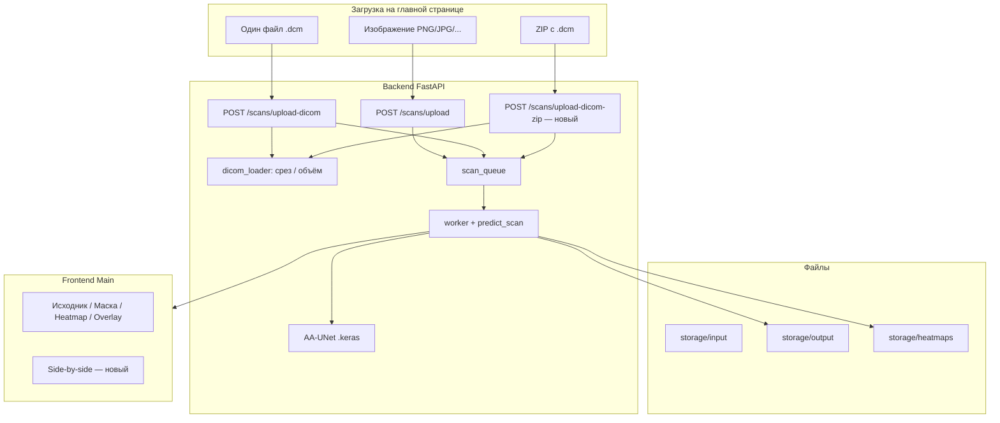

# План интеграции AA-UNet и расширенного DICOM в MRI Analyzer

**Дата:** июнь 2026 г.  
**Статус:** Фазы A, B и C выполнены (июнь 2026)  
**Основание:** `PROJECT_FINAL_ANALYSIS.md`, папка `mri_project/`, ответы на уточняющие вопросы

---

## Решения по продукту

| # | Вопрос | Решение |
|---|--------|---------|
| 1 | Архитектура в проде | **AA-UNet** (`modified_unet.py`) |
| 2 | Режимы загрузки | Три режима: **изображение**, **один DICOM (.dcm)**, **ZIP с папкой DICOM** |
| 3 | Обучение модели | Пользователь обучает **локально**; старый `unet_brain_mri_final.keras` **удалить**; при обучении сохранить **те же имена** переменных, путей и выходов, что в текущем API |
| 4 | Папка `mri_project/` | **Оставить** в репозитории (справочник / диплом) |
| 5 | Просмотр результатов | Текущий набор (исходник / маска / heatmap / overlay) **+ режим side-by-side** (исходник + маска) |
| 6 | `compare_architectures.py` | Перенести в `api/`, запуск **только из терминала** для исследовательской аналитики; **не встраивать** в HTTP, worker, frontend |

---

## Целевое состояние системы



---

## Часть 1. Перенос файлов из `mri_project` в `api`

### 1.1. Карта переноса

| Источник (`mri_project/`) | Назначение (`api/`) | Действие |
|---------------------------|---------------------|----------|
| `utils/modified_unet.py` | `app/ai/train/modified_unet.py` | Скопировать; единственный источник определения AA-UNet |
| `utils/model.py` | `app/ai/train/unet_baseline.py` (опционально) | Только если нужен baseline для `compare_architectures`; иначе оставить в `architectures.py` |
| `utils/architectures.py` | `app/ai/train/architectures.py` | Скопировать; для compare и диплома |
| `utils/losses.py` | `app/ai/services/metrics.py` | Не дублировать файл: сверить с `metrics.py`, добавить `CUSTOM_OBJECTS` если отсутствует |
| `utils/dicom_loader.py` | `app/ai/services/dicom_loader.py` | Скопировать; основной модуль DICOM |
| `train.py` | `app/ai/train/train_aa_unet.py` | Адаптировать пути: `data/` → `app/ai/datasets/`, `models/` → `app/ai/models/` |
| `compare_architectures.py` | `app/ai/train/compare_architectures.py` | Скопировать; **только CLI**, без импорта из `routes` / `worker` |
| `requirements.txt` | — | Сверить с `api/requirements.txt`; дубликаты не добавлять |
| `data/`, битый `{models,data...}` | — | **Не переносить**; данные уже в `app/ai/datasets/` |
| `README.md` | — | Оставить в `mri_project/`; при необходимости краткая ссылка в `api/app/ai/README.md` |

Папка **`mri_project/`** в корне репозитория **не удаляется**.

### 1.2. Что заменить в существующем API

| Файл | Изменение |
|------|-----------|
| `app/ai/services/dicom_parser.py` | Заменить логику на вызовы `dicom_loader` или удалить после миграции импортов |
| `app/ai/services/model.py` | Загрузка **AA-UNet**; путь к весам; расширенный `custom_objects` (кастомные слои AA-UNet) |
| `app/ai/train/model.py` | Синхронизировать с baseline U-Net только для offline-сравнения; прод — AA-UNet |
| `app/ai/services/predict.py` | Ветка для объёма (ZIP): `predict_volume`, агрегированная статистика, сохранение представительной маски / сводки |
| `app/ai/services/result_text.py` | Для объёма — текст из `generate_volume_conclusion` (или адаптация) |
| `app/routes/scans.py` | Новый эндпоинт ZIP; обновить `upload-dicom` на `read_dicom_slice` |
| `app/models/scan.py` | При необходимости: `source_type`: `image` \| `dicom` \| `dicom_zip`; поля для числа срезов / индекса репрезентативного среза |
| `app/ai/models/unet_brain_mri_final.keras` | **Удалить** из репозитория после появления новых весов |

### 1.3. Имена при обучении (сохранить для совместимости)

При локальном обучении пользователь сохраняет артефакты с **теми же именами**, что ожидает runtime:

| Артефакт | Путь / имя |
|----------|------------|
| Финальная модель (прод) | `api/app/ai/models/aa_unet_brain_mri_final.keras` *(или согласованное имя — см. ниже)* |
| Checkpoint при обучении | `best_aa_unet.keras` / `ModelCheckpoint` как в скрипте train |
| Выход инференса в worker | `result_path`, `confidence`, `tumor_detected`, `heatmap_path`, `heatmap_raw_path` — **без переименования** полей в MongoDB и WebSocket |
| Каталоги storage | `storage/input`, `storage/output`, `storage/heatmaps` — без изменений |
| Custom objects при `load_model` | `bce_dice_loss`, `dice_coef`, `dice_loss`, `iou_metric` + объекты AA-UNet при необходимости |

**Рекомендуемое имя файла прод-модели:** `aa_unet_brain_mri_final.keras`  
В `app/ai/services/model.py` обновить константу `MODEL_PATH` на этот файл. Старое имя `unet_brain_mri_final.keras` больше не используется.

Скрипт обучения (`train_aa_unet.py`) должен:

- читать данные из `app/ai/datasets/X_train`, `Y_train`, `X_val`, `Y_val`;
- сохранять модель в `app/ai/models/aa_unet_brain_mri_final.keras`;
- использовать те же метрики/loss, что в `metrics.py` (`CUSTOM_OBJECTS`).

---

## Часть 2. AA-UNet в runtime

### 2.1. Загрузка модели

1. Определение архитектуры: `from app.ai.train.modified_unet import build_aa_unet` (или экспорт builder из того же модуля).
2. `load_model(MODEL_PATH, custom_objects={**metrics.CUSTOM_OBJECTS, ...})` — добавить все кастомные слои/Lambda из AA-UNet, иначе Keras не загрузит веса.
3. При старте API: если файл модели отсутствует — понятная ошибка в логах (обучение ещё не выполнено).

### 2.2. Инференс

| Режим загрузки | Поведение |
|----------------|-----------|
| Изображение | Как сейчас: `preprocess_image` → `model.predict` → маска + Grad-CAM |
| Один `.dcm` | `read_dicom_slice` → predict → маска + Grad-CAM |
| ZIP с DICOM | Распаковка во временную папку → `load_dicom_volume` → `predict_volume` → `volume_stats` → сохранение **репрезентативного** среза (например, `max_slice_idx`) как PNG для UI + сводный `result_desc` |

### 2.3. Метрики `confidence` / `tumor_detected`

Пересмотреть для сегментации (не только `np.max(prediction)`):

- для одного среза: доля пикселей маски выше порога или max probability по маске;
- для объёма: агрегат из `volume_stats` (`total_area_frac`, `n_positive`).

Имена полей в БД и WebSocket **не менять**.

---

## Часть 3. Третий режим загрузки — ZIP с DICOM

### 3.1. Backend

- **Новый эндпоинт:** `POST /scans/upload-dicom-zip`
- Валидация: расширение `.zip`, лимит размера (задать в config, например `MAX_DICOM_ZIP_MB`).
- Распаковка в `storage/input/{scan_id}/` (подпапка), поиск `.dcm`, сортировка через `dicom_loader`.
- `source_type`: `dicom_zip` (расширение enum в модели scan).
- Очередь: в worker передаётся путь к папке или к индексному PNG после препроцессинга — зафиксировать в реализации один вариант.

### 3.2. Frontend (`Main.tsx`)

- Третья кнопка режима: **«DICOM (ZIP)»**.
- `FileUploader`: `accept` `.zip`, endpoint `/scans/upload-dicom-zip`.
- При `done`: те же эндпоинты просмотра; при объёме — показывать сводку в `result_desc` (если API отдаёт в GET scan или WS).

### 3.3. Ограничения (документировать)

- Один ZIP = одно исследование в очереди.
- Таймаут обработки объёма может быть выше, чем для одного среза — учесть в UX (текст «анализ серии срезов…»).

---

## Часть 4. Просмотр результатов (frontend)

### 4.1. Сохранить

- Исходник  
- Маска  
- Heatmap (raw)  
- Overlay (Grad-CAM)

### 4.2. Добавить

- **Side-by-side:** исходник слева, маска справа (или наложение 50/50) в одном блоке.
- Реализация: новое значение `ResultView = 'sideBySide'`; CSS grid/flex в `Main.module.css`; аналогично в `RequestDetail` / `ScanDetail` для истории.

### 4.3. Без изменений в этой итерации

- Слайдер по всем срезам объёма (опционально — фаза 2).

---

## Часть 5. Скрипт сравнения архитектур (только терминал)

**Файл:** `api/app/ai/train/compare_architectures.py` (из `mri_project/compare_architectures.py`)

**Назначение:** единоразовый запуск исследователем для таблиц метрик и графиков (диплом).

**Запуск (пример):**

```bash
cd api
source .venv/bin/activate
python -m app.ai.train.compare_architectures --epochs 20 --data_dir app/ai/datasets
```

**Выходы (сохранить имена из оригинала):**

- `comparison_results/metrics.csv`
- `comparison_results/training_curves.png`
- `comparison_results/metrics_bar.png`
- `comparison_results/radar_chart.png`
- `comparison_results/predictions_grid.png`

Каталог `comparison_results/` — в `.gitignore` или под `app/ai/train/outputs/comparison_results/`.

**Явный запрет:** не импортировать `compare_architectures` из `main.py`, `worker.py`, `routes/*`.

---

## Часть 6. Порядок реализации (фазы)

### Фаза A — подготовка ML-кода (backend, без смены UI) ✅

1. ✅ Скопировать модули в `api/app/ai/train/` и `api/app/ai/services/dicom_loader.py`.
2. ✅ Добавить `train_aa_unet.py` с путями к `datasets/` и `models/aa_unet_brain_mri_final.keras`.
3. ✅ Скопировать `compare_architectures.py` → `app/ai/train/`, поправить импорты (`app.ai.train.*`).
4. ✅ Обновить `metrics.py` (`CUSTOM_OBJECTS`).
5. ✅ Удалить `unet_brain_mri_final.keras`; обновить `MODEL_PATH` (модель появится после вашего обучения).
6. ✅ Обновить `model.py` / `predict.py` под AA-UNet (ленивая загрузка, проверка наличия файла).

**Критерий:** `python -m app.ai.train.train_aa_unet` запускается локально; compare — только вручную из терминала.

### Фаза B — DICOM и ZIP (backend) ✅

1. ✅ Мигрировать `upload-dicom` на `dicom_loader` (`dicom_to_png` / `read_dicom_slice`).
2. ✅ Реализовать `POST /scans/upload-dicom-zip` + `predict_scan_volume` в worker.
3. ✅ Расширить `result_text`, поля `n_slices`, `representative_slice_idx`, метрики по маске.
4. Ручные тесты: image, single `.dcm`, zip (после обученной модели).

**Критерий:** три эндпоинта отдают `scan_id`, worker завершает с `status=done` после подстановки обученной модели.

### Фаза C — frontend ✅

1. ✅ Третий режим загрузки «DICOM (ZIP)» → `POST /scans/upload-dicom-zip`, лимит 200 МБ.
2. ✅ Режим «Сравнение» (side-by-side исходник + маска) на главной.
3. ✅ «Сравнение» и метаданные серии в `RequestDetail` (история).

**Критерий:** полный сценарий с главной страницы для всех трёх режимов.

### Фаза D — обучение (выполняет пользователь)

1. Локально: `python -m app.ai.train.train_aa_unet` (или согласованная команда).
2. Положить `aa_unet_brain_mri_final.keras` в `api/app/ai/models/`.
3. Перезапустить API, проверить инференс и Grad-CAM.

### Фаза E — документация и чистка

1. Обновить корневой `README.md`: три режима загрузки, имя модели, команда compare.
2. Краткая заметка в `api/app/ai/README.md` (обучение + compare).
3. Проверить `.gitignore` для `comparison_results/`, больших zip в storage.

---

## Часть 7. Чеклист файлов для изменения при реализации

### Backend

- [x] `api/app/ai/train/modified_unet.py` — новый  
- [x] `api/app/ai/train/architectures.py` — новый  
- [x] `api/app/ai/train/train_aa_unet.py` — новый  
- [x] `api/app/ai/train/compare_architectures.py` — новый (CLI only)  
- [x] `api/app/ai/services/dicom_loader.py` — новый  
- [x] `api/app/ai/services/dicom_parser.py` — thin-wrapper  
- [x] `api/app/ai/services/model.py` — AA-UNet path + custom_objects  
- [x] `api/app/ai/services/predict.py` — volume branch  
- [x] `api/app/ai/services/result_text.py` — volume text  
- [x] `api/app/ai/services/metrics.py` — CUSTOM_OBJECTS  
- [x] `api/app/routes/scans.py` — upload-dicom-zip  
- [x] `api/app/models/scan.py` — source_type `dicom_zip`  
- [x] `api/app/core/config.py` — `MAX_DICOM_ZIP_MB`  
- [x] `api/app/services/dicom_zip.py` — безопасная распаковка  
- [x] Удалить `api/app/ai/models/unet_brain_mri_final.keras`

### Frontend

- [ ] `frontend/features/Main/ui/Main.tsx` — режим ZIP + side-by-side  
- [ ] `frontend/features/Main/ui/Main.module.css` — стили side-by-side  
- [ ] `frontend/features/History/ui/RequestDetail/*` — side-by-side (по аналогии)  
- [ ] `frontend/shared/ui/FileUploader` — при необходимости accept для zip  

### Не трогать

- [ ] `mri_project/` — оставить как есть  
- [ ] `compare_architectures` — не подключать к API/worker  

---

## Часть 8. Риски и митигация

| Риск | Митигация |
|------|-----------|
| AA-UNet не загружается из-за custom layers | Полный `custom_objects` + тест `load_model` после обучения |
| ZIP слишком большой / долгий инференс | Лимит размера, семафор очереди, сообщение в UI |
| Grad-CAM на AA-UNet | Проверить target layer; fallback без heatmap при ошибке (как сейчас) |
| Нет модели до обучения | Чёткое сообщение при старте; README с шагом обучения |

---

## Связанные документы

- `PROJECT_FINAL_ANALYSIS.md` — описание текущей системы  
- `mri_project/README.md` — исходная документация ML-модуля  
- `DEVELOPMENT_PLAN.md` — общий план фаз 0–8 (при наличии)

---

*План согласован с решениями: AA-UNet, ZIP DICOM, локальное обучение с прежними именами выходов, сохранение `mri_project/`, side-by-side, compare только из терминала.*
