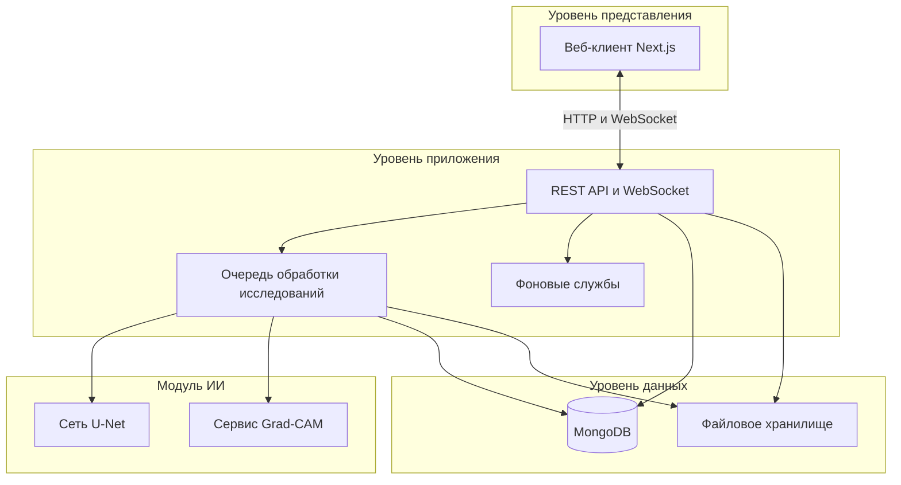
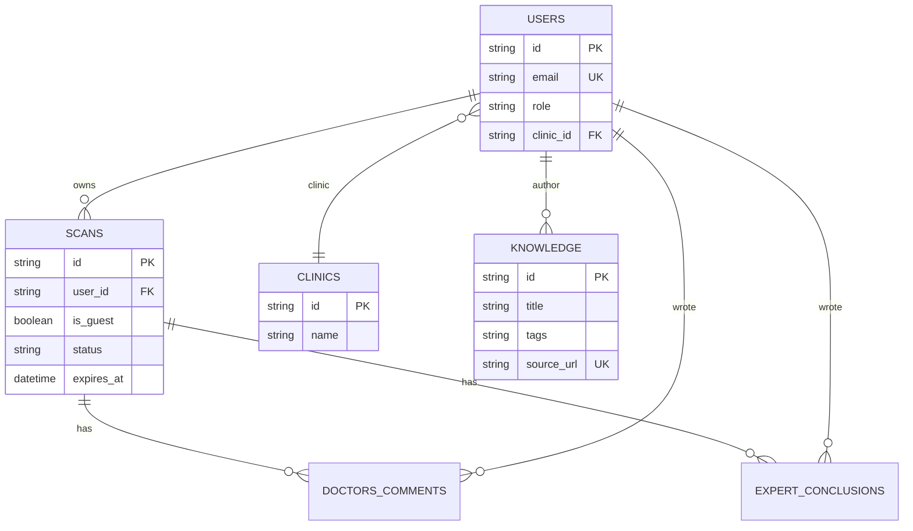
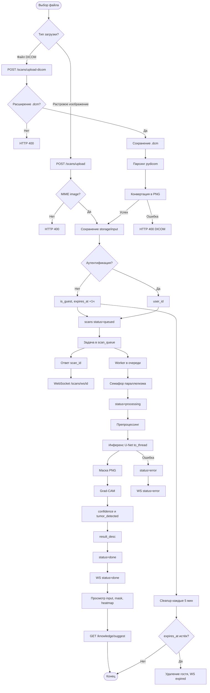
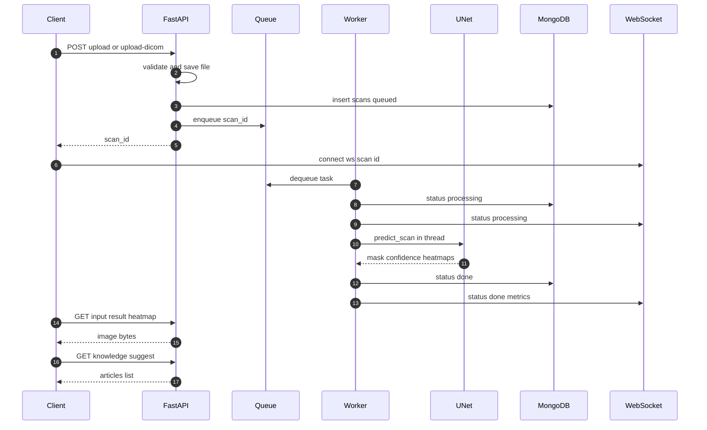
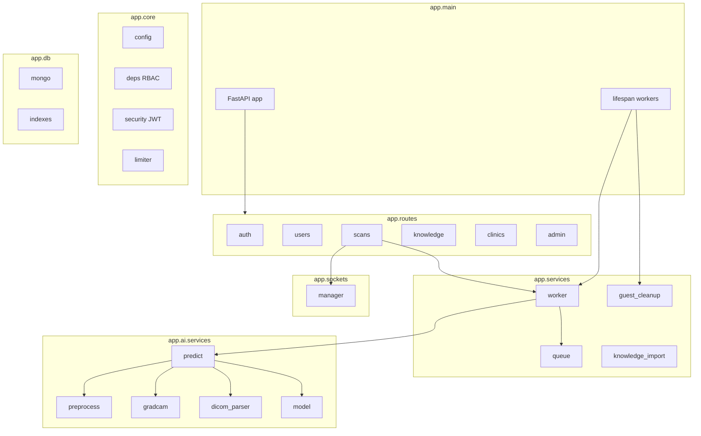
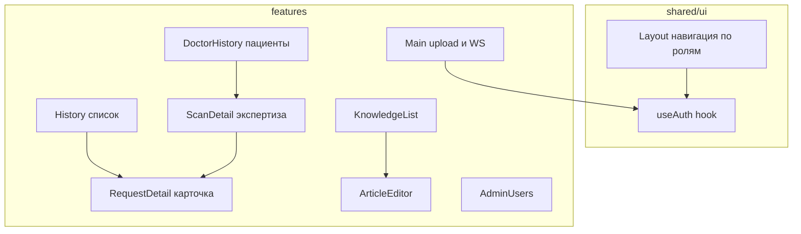

# Итоговый анализ программного комплекса «MRI Analyzer»

**Тип документа:** техническое описание реализованной системы  
**Основание:** кодовая база репозитория после выполнения фаз 0–7 плана разработки (`DEVELOPMENT_PLAN.md`)  
**Дата составления:** май 2026 г.

---

## Аннотация

Настоящий документ содержит описание веб-ориентированного программного комплекса **MRI Analyzer**, предназначенного для вспомогательного анализа магнитно-резонансных томограмм головного мозга методами глубокого обучения. Приводятся сведения об архитектуре, технологическом стеке, модели данных, вариантах использования, процессе обработки медицинских изображений, структуре программного интерфейса и клиентского приложения, а также формулировки функциональных и нефункциональных требований. Результаты работы системы носят **вспомогательный характер** и не заменяют заключение врача-специалиста.

---

## 1. Введение

### 1.1. Предметная область

Программный комплекс решает задачу автоматизированной **семантической сегментации** МРТ-снимков с применением сверточной нейронной сети архитектуры U-Net (реализация на платформе TensorFlow/Keras). Дополнительно формируется карта внимания модели (метод Grad-CAM), что повышает интерпретируемость результата для специалиста.

Помимо модуля машинного обучения комплекс включает:

- подсистему учёта пользователей и **ролевую модель разграничения доступа** (RBAC);
- подсистему хранения и просмотра истории исследований;
- **базу знаний** с редактированием материалов в формате Markdown;
- инструменты клинической экспертизы для врача (комментарии, заключения, верификация вывода ИИ);
- подсистему администрирования пользователей и справочника клиник.

### 1.2. Акторы системы

В документе используются следующие роли (акторы):

- **Гость** — неаутентифицированный посетитель; может загружать снимки и читать базу знаний, но результаты анализа хранятся ограниченное время.
- **Пользователь** (`user`) — зарегистрированное физическое лицо; ведёт личную историю анализов.
- **Врач** (`doctor`) — пользователь, привязанный к медицинской клинике; работает с каталогом пациентов клиники и экспертными функциями.
- **Администратор** (`admin`) — пользователь с полномочиями на управление учётными записями, клиниками и импортом внешних статей.

Роль «гость» в базе данных **не фиксируется**; гостевые исследования помечаются признаком `is_guest: true` в коллекции исследований.

---

## 2. Архитектура программного комплекса

### 2.1. Общая архитектурная схема

Комплекс построен по **трёхзвенной клиент-серверной архитектуре**:

- **Уровень представления** — одностраничное веб-приложение на базе Next.js 14 (маршрутизатор Pages Router), взаимодействующее с сервером по протоколам HTTP и WebSocket.
- **Уровень приложения** — серверная часть на FastAPI: REST API, очередь асинхронных задач, фоновые службы, контроль доступа.
- **Уровень данных** — СУБД MongoDB (метаданные) и **файловое хранилище** на локальной файловой системе сервера (растровые данные).
- **Вычислительный модуль ИИ** — инференс нейросети в процессе серверного приложения (in-process), с вынесением блокирующих операций в пул потоков.

### 2.2. Архитектура серверной части

Серверная часть реализована как **модульный монолит** со слоистой организацией:

- `routes` — контроллеры HTTP и WebSocket, валидация входных данных (Pydantic);
- `services` — бизнес-логика, сериализация, контроль доступа, очередь, фоновая очистка;
- `models` — схемы запросов и ответов, описание для OpenAPI;
- `db` — асинхронное подключение к MongoDB (Motor), создание индексов;
- `ai` — препроцессинг, инференс, постобработка, разбор DICOM, Grad-CAM;
- `core` — конфигурация, JWT, зависимости FastAPI, ограничение частоты запросов;
- `sockets` — диспетчер WebSocket-соединений по идентификатору исследования.

Синхронный инференс нейросети выполняется через `asyncio.to_thread()`, что предотвращает блокировку цикла событий ASGI.

### 2.3. Архитектура клиентской части

Клиентское приложение организовано по принципам **Feature-Sliced Design** (упрощённый вариант):

- каталог `pages/` — точки входа маршрутов Next.js;
- каталог `features/` — функциональные модули предметной области;
- каталог `shared/` — переиспользуемые компоненты интерфейса, HTTP-клиент, хуки аутентификации.

Общая навигационная оболочка реализована компонентом `Layout` с отображением пунктов меню в зависимости от роли.

---

## 3. Технологический стек

### 3.1. Серверная часть

- **Язык программирования:** Python 3.11 и выше.
- **Веб-фреймворк:** FastAPI 0.135.x.
- **ASGI-сервер:** Uvicorn 0.42.x.
- **Драйвер СУБД:** Motor 3.7.x (асинхронный доступ к MongoDB).
- **Валидация данных:** Pydantic v2.
- **Аутентификация:** JWT (библиотека python-jose), хеширование паролей bcrypt (passlib).
- **Машинное обучение:** TensorFlow/Keras 2.15.x, файл модели `unet_brain_mri_final.keras`.
- **Обработка DICOM:** pydicom 3.0.x.
- **Обработка изображений:** Pillow, NumPy.
- **Импорт статей:** requests, BeautifulSoup4.
- **Ограничение частоты запросов:** SlowAPI (эндпоинт восстановления пароля).
- **Почтовая подсистема:** SMTP (модуль `services/email.py`).
- **Документирование API:** OpenAPI — интерфейсы `/docs` (Swagger UI) и `/redoc`.

### 3.2. Клиентская часть

- **Фреймворк:** Next.js 14 (Pages Router).
- **Библиотека интерфейса:** React 18.
- **HTTP-клиент:** Axios с перехватчиками обновления токена.
- **Отображение Markdown:** react-markdown.
- **Стилизация:** CSS Modules.
- **Язык:** TypeScript 5.3.

### 3.3. Инфраструктурные компоненты

- **СУБД:** MongoDB.
- **Файловые каталоги:** `storage/input`, `storage/output`, `storage/heatmaps`, `storage/avatars`.
- **Междоменное взаимодействие:** CORS для разрешённых источников.
- **Доставка статуса обработки:** WebSocket (переменная окружения `SOCKET`).

---

## 4. Модель данных

### 4.1. Коллекции MongoDB и их назначение

- **`users`** — учётные записи: аутентификационные данные, атрибуты профиля, роль, привязка к клинике.
- **`scans`** — записи об исследованиях МРТ: статус конвейера обработки, пути к файлам, результаты инференса, верификация врачом, срок хранения для гостей.
- **`knowledge`** — статьи базы знаний: заголовок, тело в Markdown, теги, источник (ручной или внешний).
- **`clinics`** — справочник медицинских клиник.
- **`doctors_comments`** — комментарии врача к конкретному исследованию.
- **`expert_conclusions`** — экспертные заключения врача по исследованию.

### 4.2. Логическая модель данных

**Семантика связей:**

- один пользователь — множество исследований (1:N);
- одна клиника — множество пользователей (1:N, необязательная связь);
- одно исследование — множество комментариев и заключений (1:N);
- врач получает доступ к исследованиям пациентов своей клиники через совпадение `users.clinic_id` (логика модулей `scan_access`, `patient_access`).

### 4.3. Физическая модель: коллекция `users`

- **`_id`** (строка, UUID) — первичный ключ.
- **`email`** (строка) — уникальный адрес электронной почты; индекс уникальности.
- **`password`** (строка) — хеш пароля (bcrypt).
- **`name`, `surname`, `middlename`** — атрибуты ФИО.
- **`role`** — перечисление: `user` | `doctor` | `admin`; индекс.
- **`clinic_id`** — внешний ключ на `clinics._id`; индекс.
- **`birthday`, `job`, `position`, `phone`** — дополнительные поля профиля.
- **`avatar_url`** — имя файла в каталоге `storage/avatars`.
- **`password_reset_token`, `password_reset_expires`** — атрибуты восстановления пароля.
- **`created_at`, `updated_at`** — метки времени.

### 4.4. Физическая модель: коллекция `scans`

- **`_id`** (строка, UUID) — первичный ключ.
- **`user_id`** — внешний ключ на владельца; `null` для гостя.
- **`is_guest`** (логический) — признак гостевого исследования.
- **`filename`** — исходное имя загруженного файла.
- **`file_path`** — путь к растровому файлу для инференса (PNG/JPG; для DICOM — сконвертированный PNG).
- **`dicom_path`** — путь к исходному файлу DICOM (при `source_type = dicom`).
- **`source_type`** — `image` | `dicom`.
- **`status`** — `queued` | `processing` | `done` | `error`; индекс.
- **`result`** — путь к маске сегментации.
- **`heatmap_path`, `heatmap_raw_path`** — пути к картам Grad-CAM (наложение и «сырая» тепловая карта).
- **`confidence`** (вещественное) — скалярная уверенность модели (0–1).
- **`tumor_detected`** (логический) — признак аномалии (`confidence > 0,5`).
- **`result_desc`** — текстовое описание результата на русском языке.
- **`doctor_verified`, `verified_by`, `verified_at`** — атрибуты верификации врачом.
- **`expires_at`** — срок удаления гостевого исследования (создание + 1 час); разреженный составной индекс с `is_guest`.
- **`created_at`, `updated_at`** — метки времени.

### 4.5. Физическая модель: прочие коллекции

**`knowledge`:** `_id`, `title`, `body` (Markdown), `tags[]`, `pathology_type`, `source` (`manual`|`external`), `source_url` (уникальный разреженный индекс), `is_external`, `author_id`, `created_at`, `updated_at`.

**`clinics`:** `_id`, `name` (индекс), `address`, `description`, `created_at`.

**`doctors_comments`:** `_id`, `scan_id` (индекс), `author_id`, `author_name`, `message`, `created_at`.

**`expert_conclusions`:** `_id`, `scan_id` (индекс), `doctor_id`, `doctor_name`, `text`, `created_at`.

### 4.6. Файловое хранилище

- `storage/input/` — загруженные исходные файлы и DICOM;
- `storage/output/` — маски сегментации (PNG);
- `storage/heatmaps/` — результаты Grad-CAM;
- `storage/avatars/` — изображения профилей.

Выдача файлов осуществляется через защищённые эндпоинты `GET /scans/input|result|heatmap/{id}` и `GET /users/avatar/{filename}` с проверкой прав доступа.

---

## 5. Варианты использования (диаграмма прецедентов)

Ниже приведены **подробные диаграммы вариантов использования** (use case). Полный реестр UC, связи include/extend и таблицы требований — в актуализированном документе `SYSTEM_FULL_DESCRIPTION.md` (разделы 9–11).

```mermaid
flowchart TB
    subgraph actors ["Акторы"]
        direction LR
        G(("Гость"))
        P(("Пользователь"))
        V(("Врач"))
        ADM(("Администратор"))
    end

    subgraph uc_auth ["Идентификация и учёт"]
        UC01["Зарегистрироваться"]
        UC02["Войти в систему"]
        UC03["Выйти из системы"]
        UC04["Обновить токен"]
        UC05["Восстановить пароль"]
        UC06["Просмотреть профиль"]
        UC07["Редактировать профиль"]
        UC08["Загрузить аватар"]
        UC09["Выбрать клинику"]
    end

    subgraph uc_mri ["Анализ МРТ"]
        UC10["Загрузить изображение"]
        UC11["Загрузить DICOM"]
        UC11z["Загрузить ZIP DICOM"]
        UC12["Статус обработки WS"]
        UC13["Просмотр исходника"]
        UC14["Просмотр маски"]
        UC15["Просмотр Grad-CAM"]
        UC15b["Сравнение side-by-side"]
        UC16["Текст заключения ИИ"]
        UC17["Рекомендуемые статьи"]
    end

    subgraph uc_hist ["История и сравнение"]
        UC20["История исследований"]
        UC21["Фильтр истории"]
        UC22["Удалить исследование"]
        UC23["Похожие исследования"]
        UC24["Сравнить исследования"]
    end

    subgraph uc_doc ["Врачебная экспертиза"]
        UC30["Каталог пациентов"]
        UC31["Поиск пациента"]
        UC32["Исследования пациента"]
        UC33["Подтвердить ИИ"]
        UC34["Отклонить ИИ"]
        UC35["Комментарий"]
        UC36["Экспертное заключение"]
    end

    subgraph uc_kb ["База знаний"]
        UC40["Список статей"]
        UC41["Читать статью"]
        UC42["Фильтр по тегам"]
        UC43["Создать статью"]
        UC44["Редактировать статью"]
        UC45["Удалить статью"]
        UC46["Импорт статей"]
    end

    subgraph uc_adm ["Администрирование"]
        UC50["Список пользователей"]
        UC51["Назначить роль"]
        UC52["Справочник клиник"]
    end

    G --> UC10
    G --> UC11
    G --> UC11z
    G --> UC12
    G --> UC40
    G --> UC41
    G --> UC42

    P --> UC02
    P --> UC03
    P --> UC06
    P --> UC07
    P --> UC08
    P --> UC09
    P --> UC10
    P --> UC11
    P --> UC11z
    P --> UC12
    P --> UC13
    P --> UC14
    P --> UC15
    P --> UC15b
    P --> UC16
    P --> UC17
    P --> UC20
    P --> UC21
    P --> UC22
    P --> UC23
    P --> UC24
    P --> UC40
    P --> UC41
    P --> UC42

    V --> UC30
    V --> UC31
    V --> UC32
    V --> UC33
    V --> UC34
    V --> UC35
    V --> UC36
    V --> UC43
    V --> UC44
    V --> UC45
    V -.->|"функции пользователя"| P

    ADM --> UC50
    ADM --> UC51
    ADM --> UC52
    ADM --> UC46
    ADM -.->|"функции врача"| V
```

### 5.1. Пояснения к диаграмме вариантов использования

**Подсистема идентификации.** Пользователь и врач проходят регистрацию и аутентификацию; гость ограничен анонимным доступом. Врач дополнительно указывает клинику и должность — без привязки к клинике каталог пациентов недоступен.

**Подсистема анализа МРТ.** Центральный сценарий предметной области. Гость и пользователь загружают данные; пользователь сохраняет историю, гость получает ограниченный срок хранения (1 час). Вариант «Отслеживать статус» реализован через WebSocket.

**Подсистема истории.** Пользователь работает только со своими записями. Врач на странице «История» видит каталог пациентов (отдельный вариант использования). Сравнение и поиск похожих случаев доступны авторизованным акторам в пределах своей области видимости.

**Подсистема врачебной экспертизы.** Реализует клинический контур: верификация вывода ИИ, комментарии, экспертные заключения. Доступ к исследованию пациента проверяется по совпадению `clinic_id`.

**База знаний.** Чтение — публичное (включая гостя). Редактирование — врач (свои статьи) и администратор (любые статьи). Импорт — только администратор.

**Подсистема администрирования.** Управление ролями с защитой от удаления последнего администратора; CRUD клиник с запретом удаления при наличии привязанных пользователей.

### 5.2. Детальная диаграмма конвейера МРТ (include)

См. идентичную схему в `SYSTEM_FULL_DESCRIPTION.md`, § 9.3.

### 5.3. Реестр вариантов использования

Полная таблица **UC-01 … UC-81** с акторами и описаниями — `SYSTEM_FULL_DESCRIPTION.md`, § 9.5.

---

## 6. Процесс обработки растрового изображения и файла DICOM

Настоящий раздел описывает **сквозной конвейер обработки** (pipeline) медицинского изображения от момента загрузки до формирования результата для пользователя. Приведены как обобщённая блок-схема, так и поэтапная расшифровка.

### 6.1. Блок-схема конвейера обработки

### 6.2. Поэтапное описание конвейера

**Этап 1. Приём данных на уровне представления.** Пользователь или гость на главной странице выбирает режим загрузки: растровое изображение (JPEG, PNG, WebP, GIF) или единичный файл DICOM с расширением `.dcm`. Клиентское приложение формирует multipart-запрос к соответствующему эндпоинту REST API.

**Этап 2. Валидация и сохранение на сервере.** Для растровых файлов проверяется MIME-тип `image/*`. Для DICOM — расширение файла и успешный разбор метаданных и пиксельных данных с последующей конвертацией в PNG (модуль `dicom_parser`). Исходные файлы сохраняются в `storage/input/`; для DICOM дополнительно сохраняется путь к `.dcm` в поле `dicom_path`.

**Этап 3. Формирование записи исследования.** В коллекции `scans` создаётся документ со статусом `queued`. Для гостя устанавливаются `is_guest: true` и `expires_at` (текущее время + 1 час). Для аутентифицированного пользователя — `user_id` и отсутствие срока автоматического удаления. Идентификатор исследования возвращается клиенту.

**Этап 4. Постановка в очередь.** Задача `{scan_id, path}` помещается в асинхронную очередь `scan_queue`. Одновременно обрабатывается не более N задач (семафор, по умолчанию — по числу ядер CPU); запущено три рабочих корутины `process_scan_task`.

**Этап 5. Уведомление о ходе обработки.** Клиент устанавливает WebSocket-соединение `/scans/ws/{scan_id}` (опционально с JWT в query-параметре `token`). При переходе в `processing` и по завершении сервер отправляет JSON-сообщения со статусом и метриками.

**Этап 6. Препроцессинг.** Модуль `preprocess` приводит изображение к формату, ожидаемому обученной моделью (нормализация, изменение размера).

**Этап 7. Инференс нейросети.** Функция `predict_scan` выполняется в отдельном потоке (`asyncio.to_thread`). Сеть U-Net формирует карту вероятностей сегментации. Скаляр `confidence` определяется как максимум выходного тензора; бинарный признак `tumor_detected` устанавливается при `confidence > 0,5`.

**Этап 8. Постобработка и объяснимость.** Маска сохраняется в `storage/output/`. Модуль `gradcam` строит тепловую карту внимания и наложение на исходник; пути записываются в `heatmap_path` и `heatmap_raw_path`. Модуль `result_text` формирует текстовое описание на русском языке с оговоркой о вспомогательном характере.

**Этап 9. Завершение или ошибка.** При успехе статус `done`, клиент загружает изображения через `GET /scans/input|result|heatmap/{id}` (blob) и может запросить рекомендуемые статьи (`GET /knowledge/suggest`). При сбое — статус `error`, сообщение передаётся по WebSocket и сохраняется в `result_desc`.

**Этап 10. Жизненный цикл гостевого исследования.** Фоновая служба `cleanup_expired_guest_scans` каждые 5 минут находит записи с `is_guest: true` и истёкшим `expires_at`, удаляет файлы с диска, запись из MongoDB и уведомляет открытый WebSocket статусом `expired`.

### 6.3. Диаграмма последовательности (взаимодействие компонентов)

---

## 7. Программный интерфейс приложения (API)

Документация OpenAPI доступна по адресам `/docs` и `/redoc`. Аутентификация защищённых методов — схема **Bearer JWT**.

### 7.1. Модуль аутентификации (`/auth`)

- `POST /register` — регистрация учётной записи;
- `POST /login` — выдача пары токенов access и refresh;
- `POST /refresh` — обновление access-токена;
- `POST /forgot-password` — инициация сброса пароля (ограничение 5 запросов в минуту);
- `POST /reset-password` — установка нового пароля по токену.

### 7.2. Модуль пользователя (`/users`)

- `GET /me` — получение профиля (включая название клиники);
- `PUT /me` — обновление атрибутов профиля и `clinic_id`;
- `POST /avatar` — загрузка изображения аватара;
- `GET /avatar/{filename}` — выдача файла аватара.

### 7.3. Модуль исследований (`/scans`)

- `POST /upload`, `POST /upload-dicom` — приём данных (аутентификация необязательна);
- `GET /` — список исследований с пагинацией и фильтрами;
- `GET /patients`, `GET /patients/{user_id}` — каталог пациентов и их исследования (врач, администратор);
- `GET /similar` — поиск похожих завершённых исследований;
- `GET /result|input|heatmap/{id}` — выдача файлов результата;
- `GET /{id}`, `DELETE /{id}` — просмотр и удаление;
- `GET|POST /{id}/comments`, `GET|POST /{id}/conclusion`, `PUT /{id}/verify` — врачебная экспертиза;
- `WS /ws/{id}` — поток статусов обработки.

### 7.4. Модуль базы знаний (`/knowledge`)

- `GET /`, `GET /{id}`, `GET /suggest` — публичное чтение и рекомендации;
- `POST /`, `PUT /{id}`, `DELETE /{id}` — редактирование (врач, администратор);
- `POST /import` — импорт статей (администратор).

### 7.5. Модули клиник и администрирования

- `GET /clinics/` — справочник для профиля (аутентифицированные пользователи);
- `GET|PATCH /admin/users` — управление пользователями;
- `GET|POST|PUT|DELETE /admin/clinics` — управление клиниками.

### 7.6. Фоновые службы (вне HTTP)

- три экземпляра `process_scan_task` — непрерывная обработка очереди;
- `cleanup_expired_guest_scans` — каждые 5 минут;
- `run_import` (база знаний) — раз в 24 часа.

---

## 8. Диаграмма пакетов серверной части

---

## 9. Структура клиентского приложения

### 9.1. Организация каталогов

- `pages/` — маршруты: `/`, `/login`, `/profile`, `/history`, `/compare`, `/knowledge`, `/admin` и др.;
- `features/` — модули `Main`, `Auth`, `History`, `Knowledge`, `Compare`, `Admin`, `Profile`;
- `shared/` — `api`, `lib/hooks`, `ui` (Layout, Loader, Button, Pagination).

### 9.2. Соответствие маршрутов и компонентов

- `/` — `Main` (все акторы);
- `/login`, `/reset-password` — аутентификация (без общего Layout);
- `/profile` — `Profile` (аутентифицированные);
- `/history` — `History` (пользователь) или `DoctorHistory` (врач, администратор);
- `/history/[userId]` — `PatientScans` (врач, администратор);
- `/history/[userId]/[scanId]` — `ScanDetail` (врач, администратор);
- `/compare` — `CompareScans`;
- `/knowledge`, `/knowledge/[id]` — чтение статей (все);
- `/knowledge/edit` — `ArticleEditor` (врач);
- `/admin`, `/admin/clinics` — `AdminUsers`, `AdminClinics` (администратор);
- `/403` — страница отказа в доступе.

### 9.3. Диаграмма компонентов клиентской части

---

## 10. Функции системы по категориям акторов

### 10.1. Взаимодействие гостя и пользователя с системой

**Идентификация и профиль (пользователь):**

- UC-01 — регистрация по электронной почте с валидацией пароля;
- UC-02 — вход и выход; автоматическое обновление access-токена;
- UC-03 — восстановление пароля через электронную почту;
- UC-04 — просмотр и редактирование профиля (ФИО, контакты, аватар);
- UC-05 — выбор клиники из справочника.

**Анализ МРТ (гость и пользователь):**

- UC-06 — загрузка растрового изображения;
- UC-07 — загрузка файла DICOM с конвертацией;
- UC-08 — отслеживание статуса по WebSocket;
- UC-09 — просмотр исходника, маски, Grad-CAM (режимы overlay/raw);
- UC-10 — получение текстового описания и показателя уверенности;
- UC-11 — получение рекомендуемых статей из базы знаний;
- UC-12 — гостевой режим с предупреждением об удалении через 1 час;
- UC-13 — автоматическое удаление гостевого результата по истечении срока.

**История и сравнение (пользователь):**

- UC-14 — просмотр личной истории с пагинацией;
- UC-15 — фильтрация по статусу, дате, имени файла;
- UC-16 — просмотр деталей завершённого исследования;
- UC-17 — удаление собственного исследования;
- UC-18 — переход к сравнению похожих случаев;
- UC-19 — сопоставление до четырёх исследований на одном экране.

**База знаний (все посетители):**

- UC-20 — просмотр списка статей с фильтром по тегам;
- UC-21 — чтение статьи с рендерингом Markdown.

### 10.2. Взаимодействие врача с системой

Врач использует функции пользователя там, где это применимо, и дополнительно:

**Профиль врача:**

- UC-D01 — обязательная привязка к клинике для доступа к пациентам;
- UC-D02 — указание должности.

**Работа с пациентами:**

- UC-D03 — просмотр каталога пациентов своей клиники;
- UC-D04 — поиск по ФИО и email;
- UC-D05 — просмотр профиля пациента и списка его исследований;
- UC-D06 — детальный просмотр исследования пациента с экспертными инструментами.

**Клиническая экспертиза:**

- UC-D07 — подтверждение результата ИИ;
- UC-D08 — отклонение (несогласие) с результатом ИИ;
- UC-D09 — добавление и просмотр комментариев;
- UC-D10 — формирование экспертного заключения.

**История и база знаний:**

- UC-D11 — на странице «История» отображается каталог пациентов, а не личные исследования;
- UC-D12 — доступ к исследованиям в рамках клиники;
- UC-D13 — создание, редактирование и удаление **собственных** статей;
- UC-D14 — поиск похожих случаев в области видимости врача.

### 10.3. Взаимодействие администратора с системой

Администратор наследует полномочия врача (где не ограничено явно) и дополнительно:

**Управление пользователями:**

- UC-A01 — просмотр списка с пагинацией и поиском;
- UC-A02 — назначение ролей `user`, `doctor`, `admin`;
- UC-A03 — запрет понижения единственного администратора.

**Управление клиниками:**

- UC-A04 — создание, редактирование, удаление записей справочника;
- UC-A05 — запрет удаления клиники при наличии привязанных пользователей.

**База знаний и системный доступ:**

- UC-A06 — редактирование и удаление любой статьи;
- UC-A07 — запуск импорта статей с neurosurgeru.org;
- UC-A08 — полный доступ ко всем исследованиям;
- UC-A09 — удаление любого исследования;
- UC-A10 — просмотр каталога пациентов без фильтра по клинике.

**Первичное развёртывание:**

- UC-A11 — назначение роли `admin` вручную через СУБД или API после регистрации первого пользователя.

---

## 11. Функциональные требования

### 11.1. Идентификация и разграничение доступа

- **ФТ-ID-01.** Система должна обеспечивать регистрацию пользователей по адресу электронной почты с проверкой сложности пароля (не менее 8 символов, буква и цифра).
- **ФТ-ID-02.** Система должна выдавать JWT access- и refresh-токены при успешной аутентификации.
- **ФТ-ID-03.** Система должна обновлять access-токен без повторного ввода учётных данных.
- **ФТ-ID-04.** Система должна поддерживать восстановление пароля через электронную почту.
- **ФТ-ID-05.** Система должна разграничивать доступ по ролям: пользователь, врач, администратор.
- **ФТ-ID-06.** Система должна допускать гостевую загрузку исследований без аутентификации.

### 11.2. Анализ медицинских изображений

- **ФТ-МРТ-01.** Система должна принимать растровые изображения форматов JPG, PNG, WebP, GIF.
- **ФТ-МРТ-02.** Система должна принимать одиночные файлы DICOM (`.dcm`) с преобразованием в растровый формат.
- **ФТ-МРТ-03.** Система должна принимать ZIP-архив с серией DICOM (безопасная распаковка, рекурсивный поиск, лимит `MAX_DICOM_ZIP_MB`).
- **ФТ-МРТ-04.** Система должна ставить исследования в очередь и обрабатывать их асинхронно (до трёх параллельных задач).
- **ФТ-МРТ-05.** Система должна уведомлять клиента о смене статуса через WebSocket.
- **ФТ-МРТ-06.** Система должна формировать маску сегментации, показатель уверенности и признак выявления аномалии.
- **ФТ-МРТ-07.** Система должна генерировать карты Grad-CAM (наложение и «сырой» вариант).
- **ФТ-МРТ-08.** Система должна предоставлять текстовое описание результата на русском языке; для ZIP — объёмную сводку по серии срезов.
- **ФТ-МРТ-09.** Система должна поддерживать просмотр результата в режиме сравнения исходника и маски (side-by-side).
- **ФТ-МРТ-10.** Система должна удалять гостевые исследования и связанные файлы через 1 час после создания.

> **Полный перечень** функциональных и нефункциональных требований с критериями приёмки — см. `SYSTEM_FULL_DESCRIPTION.md`, разделы 10–11.

### 11.3. История и сравнение

- **ФТ-ИСТ-01.** Пользователь должен видеть только собственные исследования.
- **ФТ-ИСТ-02.** Пользователь должен иметь возможность фильтровать историю по статусу, дате и имени файла.
- **ФТ-ИСТ-03.** Пользователь должен иметь возможность удалять собственные исследования.
- **ФТ-ИСТ-04.** Система должна находить похожие исследования по признаку аномалии и диапазону уверенности ±0,15.
- **ФТ-ИСТ-05.** Пользователь должен иметь возможность сравнивать до четырёх исследований на одной странице.

### 11.4. Врачебный модуль

- **ФТ-ВР-01.** Врач должен видеть каталог пациентов только своей клиники.
- **ФТ-ВР-02.** Врач должен просматривать все исследования выбранного пациента той же клиники.
- **ФТ-ВР-03.** Врач должен подтверждать или отклонять результат ИИ.
- **ФТ-ВР-04.** Врач должен добавлять комментарии и экспертные заключения.
- **ФТ-ВР-05.** Врач должен указывать клинику и должность в профиле.

### 11.5. База знаний

- **ФТ-БЗ-01.** Любой посетитель должен иметь возможность читать статьи без аутентификации.
- **ФТ-БЗ-02.** Врач должен создавать и редактировать статьи в формате Markdown с тегами.
- **ФТ-БЗ-03.** Система должна рекомендовать статьи по результату анализа.
- **ФТ-БЗ-04.** Администратор должен иметь возможность импорта статей с внешнего источника.
- **ФТ-БЗ-05.** Система не должна создавать дубликаты статей с одинаковым `source_url`.

### 11.6. Администрирование

- **ФТ-АДМ-01.** Администратор должен просматривать список пользователей с пагинацией и поиском.
- **ФТ-АДМ-02.** Администратор должен назначать роли пользователя, врача, администратора.
- **ФТ-АДМ-03.** Система не должна допускать понижение роли последнего администратора.
- **ФТ-АДМ-04.** Администратор должен выполнять полный цикл управления справочником клиник.
- **ФТ-АДМ-05.** Система не должна удалять клинику при наличии привязанных пользователей.

---

## 12. Нефункциональные требования

### 12.1. Производительность и масштабируемость

- **НФТ-ПР-01.** Очередь обработки должна ограничивать параллелизм задач машинного обучения семафором.
- **НФТ-ПР-02.** Инференс должен выполняться в отдельном потоке, не блокируя цикл событий ASGI.
- **НФТ-ПР-03.** Списковые эндпоинты должны поддерживать постраничную навигацию.
- **НФТ-ПР-04.** В MongoDB должны быть созданы индексы на часто используемых полях.

### 12.2. Безопасность

- **НФТ-БЗ-01.** Пароли должны храниться в виде bcrypt-хешей.
- **НФТ-БЗ-02.** Защищённые методы API должны требовать JWT Bearer.
- **НФТ-БЗ-03.** Доступ к файлам исследований должен проверяться централизованной функцией `can_access_scan`.
- **НФТ-БЗ-04.** Запрос сброса пароля должен ограничиваться по частоте (5 в минуту).
- **НФТ-БЗ-05.** Политика CORS должна допускать только разрешённые источники.
- **НФТ-БЗ-06.** Файлы аватаров должны выдаваться только владельцу или администратору.

### 12.3. Надёжность и сопровождаемость

- **НФТ-НД-01.** При ошибке инференса исследование должно переходить в статус `error` с описанием.
- **НФТ-НД-02.** Фоновая очистка гостевых данных должна выполняться каждые 5 минут.
- **НФТ-НД-03.** API должно документироваться в формате OpenAPI.
- **НФТ-НД-04.** Удаление исследования должно сопровождаться удалением файлов с диска.

### 12.4. Эргономика интерфейса

- **НФТ-ИН-01.** Интерфейс должен отображать единый индикатор загрузки при ожидании данных.
- **НФТ-ИН-02.** Гость должен видеть предупреждение о сроке хранения результата.
- **НФТ-ИН-03.** Навигация должна зависеть от роли пользователя.
- **НФТ-ИН-04.** Результаты анализа должны сопровождаться дисклеймером о вспомогательном характере.

### 12.5. Развёртывание и совместимость

- **НФТ-РЗ-01.** Серверная часть должна запускаться через Uvicorn с конфигурацией из `.env`.
- **НФТ-РЗ-02.** Клиентская часть должна собираться средствами Next.js; переменные `API_HOST`, `SOCKET`.
- **НФТ-РЗ-03.** Метаданные должны храниться в MongoDB.
- **НФТ-РЗ-04.** Импорт статей должен соблюдать `robots.txt` и паузы между HTTP-запросами.

### 12.6. Медико-этические ограничения

- **НФТ-МЕ-01.** Система не должна позиционировать результаты как медицинский диагноз.
- **НФТ-МЕ-02.** Тексты интерфейса должны указывать вспомогательный характер анализа.
- **НФТ-МЕ-03.** Рекомендуемая формулировка патологии в тегах — обобщённая («опухоль головного мозга»), не клинический диагноз.

---

## 13. Ограничения и известные особенности реализации

1. Режим **dicom** — один файл `.dcm` за загрузку; режим **dicom_zip** — серия из архива (не все форматы PACS).
2. Модуль машинного обучения выполняется **in-process**; горизонтальное масштабирование вычислений требует выделения отдельного сервиса инференса.
3. Первый администратор назначается **вручную** в СУБД после регистрации.
4. Импорт статей зависит от доступности и структуры внешнего сайта neurosurgeru.org.
5. При развёртывании нескольких экземпляров API необходим sticky load balancer или общий брокер сообщений для WebSocket.
6. Фаза 8 плана (автоматизированное тестирование, docker-compose, CI) на момент анализа **не реализована**.

---

## 14. Заключение

Программный комплекс MRI Analyzer представляет собой законченное веб-решение для вспомогательного анализа МРТ-снимков с разграничением ролей, клиническим контуром для врача, административной подсистемой и базой знаний. Архитектура построена на проверенных open-source компонентах; конвейер обработки изображений реализован как асинхронная очередь с оповещением в реальном времени. Документ может служить основой для технического задания, пояснительной записки, приёмочного тестирования и дальнейшего развития системы (фаза 8 и последующие итерации).

---

## 15. Связанные документы

- `README.md` — инструкция по развёртыванию и назначению администратора;
- `DEVELOPMENT_PLAN.md` — поэтапный план разработки (фазы 0–8);
- `PROJECT_ANALYSIS.md` — первичный анализ до реализации;
- `SYSTEM_FULL_DESCRIPTION.md` — полное описание, UC, ФТ и НФТ (июнь 2026);
- `http://localhost:8000/docs` — актуальная спецификация OpenAPI.

---

*Документ подготовлен по состоянию кодовой базы репозитория MRI Analyzer. Май 2026 г.*
