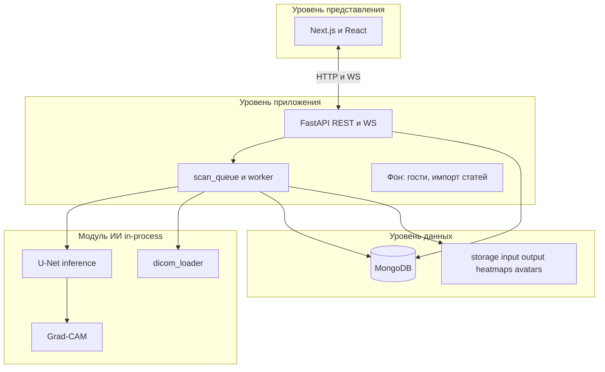
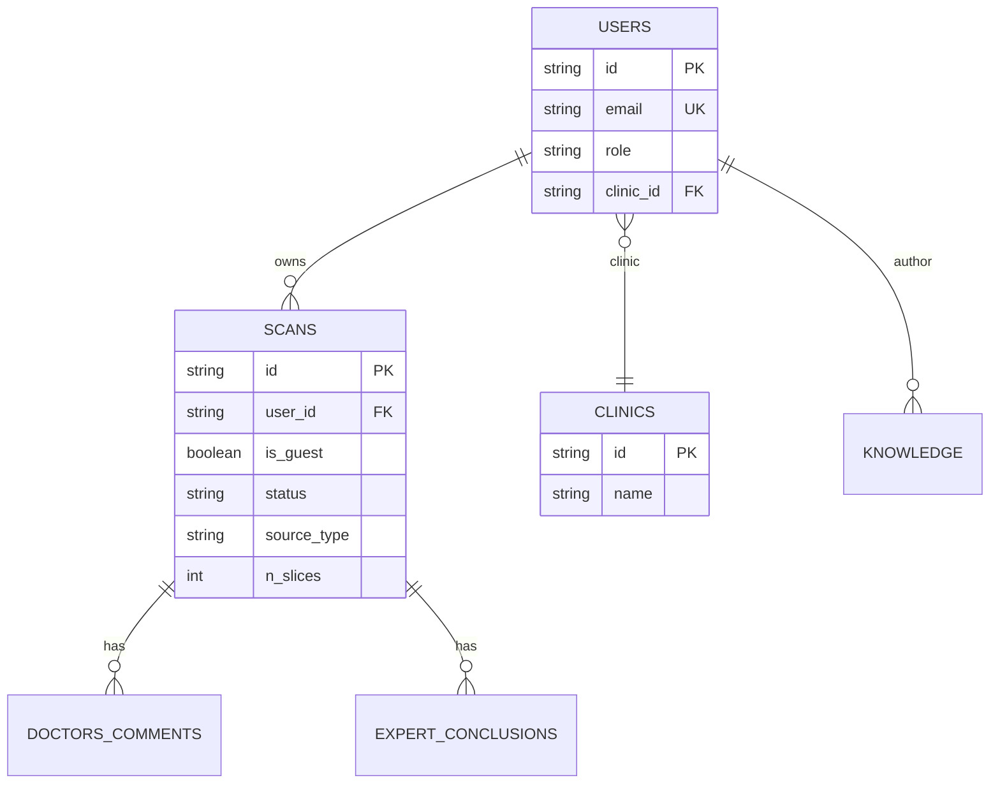
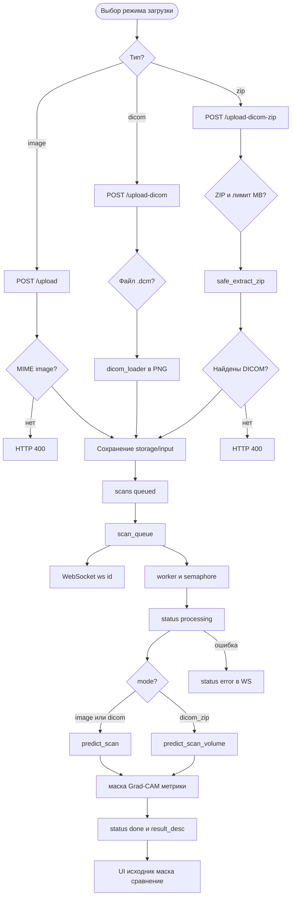
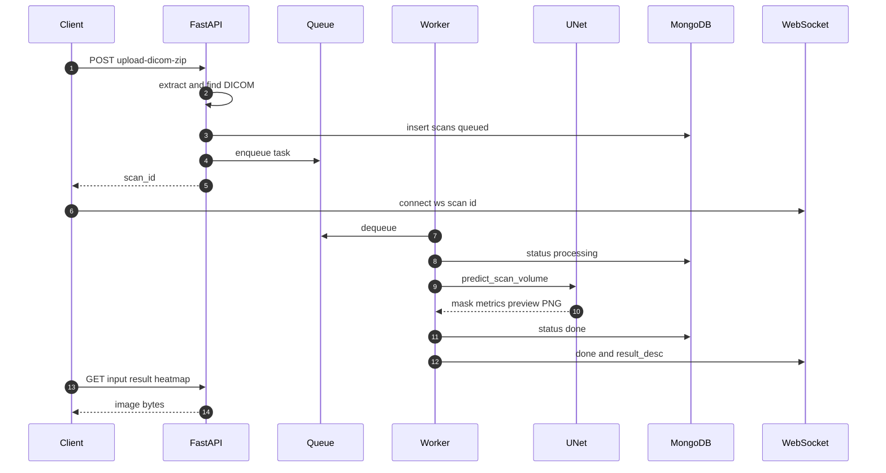
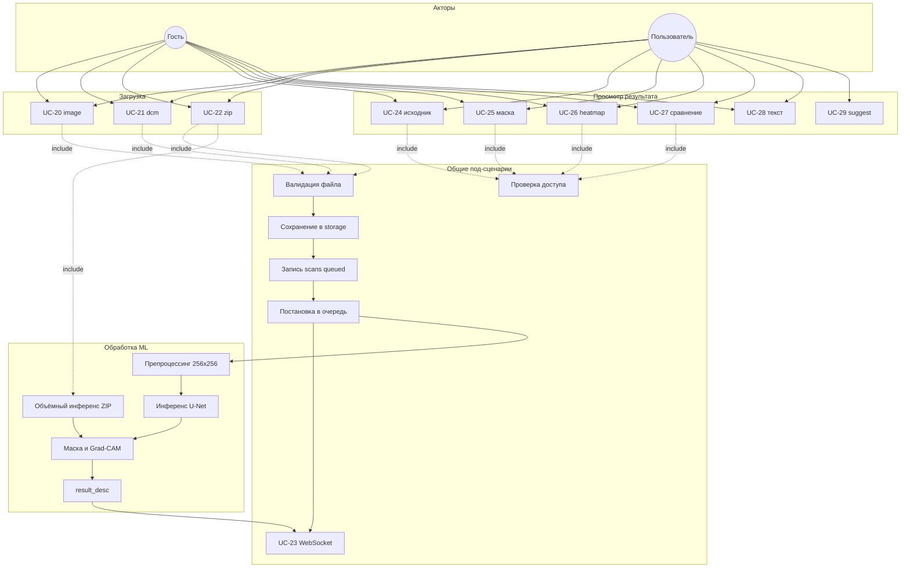
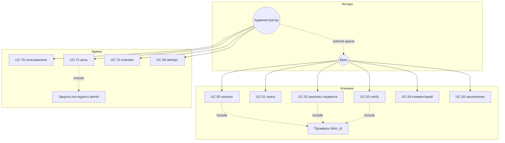

# Полное описание программного комплекса «MRI Analyzer»

**Тип документа:** техническое описание реализованной системы (актуализированная редакция)  
**Основание:** кодовая база репозитория `nirs3sem`, включая интеграцию DICOM, ZIP-архивов и модуль обучения AA-UNet  
**Дата составления:** июнь 2026 г.  
**Предыдущая редакция:** `PROJECT_FINAL_ANALYSIS.md` (май 2026 г.)

---

## Аннотация

Настоящий документ содержит **полное описание** веб-ориентированного программного комплекса **MRI Analyzer** — системы вспомогательного анализа магнитно-резонансных томограмм головного мозга методами глубокого обучения.

В **продакшене** (API, обработка загрузок пользователей) используется обученная сверточная сеть **U-Net** (`unet_brain_mri_final.keras`). Дополнительно формируются карты внимания **Grad-CAM**. Поддерживаются три формата входных данных: растровые изображения, одиночный файл **DICOM** (`.dcm`) и **ZIP-архив** с серией DICOM.

Параллельно в репозитории размещён исследовательский контур **AA-UNet** (архитектура с ASPP, attention, deep supervision) и скрипты сравнения архитектур — для обучения и научной работы; **по умолчанию API их не загружает**.

Комплекс также включает RBAC, историю исследований, базу знаний (Markdown), клинический контур для врача и администрирование. Результаты носят **вспомогательный характер** и не заменяют заключение врача-специалиста.

---

## 1. Введение

### 1.1. Предметная область

Задача предметной области — **семантическая сегментация** МРТ-снимков головного мозга: нейросеть строит маску областей, потенциально соответствующих патологии, и скалярные метрики уверенности. Для интерпретации специалистом генерируется **Grad-CAM** (тепловая карта внимания модели).

Функциональные подсистемы:

| Подсистема | Назначение |
|------------|------------|
| Модуль ИИ | Препроцессинг, инференс U-Net, DICOM, Grad-CAM, очередь задач |
| Учёт и RBAC | Регистрация, JWT, роли `user` / `doctor` / `admin`, гостевой режим |
| История и сравнение | Личные исследования, похожие случаи, сравнение до 4 записей |
| База знаний | Статьи Markdown, теги, рекомендации по результату анализа |
| Клиническая экспертиза | Верификация ИИ, комментарии, экспертные заключения |
| Администрирование | Пользователи, клиники, импорт внешних статей |

### 1.2. Акторы системы

- **Гость** — без входа в систему; загрузка и анализ с удалением результата через 1 час; чтение базы знаний.
- **Пользователь** (`user`) — личная история анализов, профиль.
- **Врач** (`doctor`) — привязка к клинике; каталог пациентов клиники; экспертиза.
- **Администратор** (`admin`) — управление пользователями, клиниками, импорт статей; расширенный доступ.

Роль «гость» в коллекции `users` **не создаётся**; гостевые исследования помечаются `is_guest: true` в `scans`.

### 1.3. Структура репозитория

```
nirs3sem/
├── api/                    # Backend FastAPI
│   └── app/
│       ├── ai/             # Модуль машинного обучения
│       ├── routes/         # HTTP / WebSocket
│       ├── services/       # Бизнес-логика
│       ├── models/         # Pydantic / OpenAPI
│       ├── db/             # MongoDB
│       └── sockets/        # WebSocket
├── frontend/               # Next.js 14
├── mri_project/            # Исходный исследовательский ML-проект (справочно)
├── storage/                # Файлы исследований (runtime)
├── PROJECT_FINAL_ANALYSIS.md
├── INTEGRATION_PLAN_AA_UNET.md
└── SYSTEM_FULL_DESCRIPTION.md   # Настоящий документ
```

---

## 2. Архитектура программного комплекса

### 2.1. Общая схема (трёхзвенная)

- **Уровень представления** — SPA на **Next.js 14** (Pages Router), HTTP + WebSocket.
- **Уровень приложения** — **FastAPI**: REST, асинхронная очередь, фоновые задачи, RBAC.
- **Уровень данных** — **MongoDB** (метаданные) + **файловое хранилище** (изображения, маски, heatmap).
- **Модуль ИИ** — инференс **in-process**, блокирующие вызовы TensorFlow в `asyncio.to_thread()`.



### 2.2. Серверная часть (модульный монолит)

| Слой | Каталог | Ответственность |
|------|---------|-----------------|
| Маршруты | `app/routes/` | HTTP, WebSocket, валидация Pydantic |
| Сервисы | `app/services/` | Очередь, worker, доступ, файлы, email, DICOM ZIP |
| Модели API | `app/models/` | Схемы запросов/ответов |
| БД | `app/db/` | Motor, индексы |
| ИИ | `app/ai/` | Инференс, обучение (offline), DICOM |
| Ядро | `app/core/` | config, JWT, deps, limiter |
| Сокеты | `app/sockets/` | Менеджер WS по `scan_id` |

### 2.3. Клиентская часть (Feature-Sliced Design)

- `frontend/pages/` — маршруты Next.js.
- `frontend/features/` — `Main`, `Auth`, `History`, `Knowledge`, `Compare`, `Admin`, `Profile`.
- `frontend/shared/` — API-клиент, `useAuth`, UI-компоненты (`Layout`, `FileUploader`, `Loader`).

Навигация в `Layout` зависит от роли пользователя.

---

## 3. Технологический стек

### 3.1. Серверная часть

| Компонент | Технология |
|-----------|------------|
| Язык | Python 3.11+ |
| Web | FastAPI ~0.135, Uvicorn ~0.42 |
| БД | MongoDB, Motor ~3.7 |
| Валидация | Pydantic v2 |
| Auth | JWT (python-jose), bcrypt (passlib) |
| ML (прод) | TensorFlow/Keras 2.15, `unet_brain_mri_final.keras` |
| DICOM | pydicom 3.x, модуль `dicom_loader` |
| Изображения | Pillow, NumPy |
| Импорт статей | requests, BeautifulSoup4 |
| Rate limit | SlowAPI (сброс пароля) |
| Почта | SMTP |
| API docs | OpenAPI `/docs`, `/redoc` |

### 3.2. Клиентская часть

| Компонент | Технология |
|-----------|------------|
| Framework | Next.js 14 (Pages Router) |
| UI | React 18, CSS Modules |
| HTTP | Axios (refresh token) |
| Markdown | react-markdown |
| Язык | TypeScript 5.3 |

### 3.3. Инфраструктура

- MongoDB.
- Каталоги: `storage/input`, `storage/output`, `storage/heatmaps`, `storage/avatars`.
- CORS для разрешённых origin.
- WebSocket: переменная `SOCKET` на клиенте.
- Лимит ZIP: `MAX_DICOM_ZIP_MB` (по умолчанию 200) в `api/.env`.

---

## 4. Модуль машинного обучения

### 4.1. Модель в продакшене (API)

| Параметр | Значение |
|----------|----------|
| Архитектура | **U-Net** (4 уровня, BatchNorm, Dropout в bottleneck, Conv2DTranspose) |
| Файл весов | `api/app/ai/models/unet_brain_mri_final.keras` |
| Загрузка | `app/ai/services/model.py` → `get_inference_model()` (ленивая) |
| Custom objects | `bce_dice_loss`, `dice_coef`, `dice_loss`, `iou_metric` |
| Вход инференса | RGB 256×256, значения [0, 1] |
| Выход | Маска 256×256×1, sigmoid |
| Метрики результата | `confidence = max(prediction)`; `tumor_detected` при `confidence > 0.5` |

Определение архитектуры (обучение): `app/ai/train/model.py` → `unet_model()`.

### 4.2. Исследовательский контур AA-UNet (не API по умолчанию)

Для диплома и экспериментов в репозитории сохранены:

| Компонент | Путь |
|-----------|------|
| AA-UNet | `app/ai/train/modified_unet.py` |
| Обучение AA-UNet | `python -m app.ai.train.train_aa_unet` |
| Сравнение архитектур | `python -m app.ai.train.compare_architectures` |
| Справочный проект | `mri_project/` (не удалять) |
| Веса AA-UNet (опционально) | `aa_unet_brain_mri_final.keras` |

Подключение AA-UNet к API требует явной смены `MODEL_PATH` в `model.py` и совместимых весов.

### 4.3. Структура каталога `app/ai/`

```
app/ai/
├── models/
│   └── unet_brain_mri_final.keras    # Продакшен
├── datasets/                          # X_train, Y_train, X_val, Y_val (обучение)
├── services/
│   ├── model.py                       # Загрузка U-Net
│   ├── predict.py                     # predict_scan, predict_scan_volume
│   ├── preprocess.py                  # 256×256 RGB
│   ├── postprocess.py                 # Сохранение маски PNG
│   ├── gradcam.py                     # Overlay + raw heatmap
│   ├── dicom_loader.py                # DICOM: срез, объём, поиск файлов
│   ├── dicom_parser.py                # Обёртка совместимости
│   ├── metrics.py                     # Dice, IoU, CUSTOM_OBJECTS
│   └── result_text.py                 # Тексты result_desc
├── train/
│   ├── model.py                       # U-Net builder
│   ├── train.py                       # Обучение U-Net (legacy script)
│   ├── train_aa_unet.py               # CLI обучения AA-UNet
│   ├── modified_unet.py               # AA-UNet + deep supervision
│   ├── architectures.py               # U-Net, Att-U-Net, ResUNet, U-Net++
│   ├── compare_architectures.py       # Только терминал, не API
│   └── dataset.py
├── custom_layers.py                   # ResizeToReference (для AA-UNet)
└── README.md
```

### 4.4. Обработка DICOM (`dicom_loader`)

- **`read_dicom_slice`** — один `.dcm` → RGB 256×256, нормализация, RescaleSlope/Intercept.
- **`load_dicom_volume`** — рекурсивный обход папки, сортировка срезов по позиции.
- **`find_dicom_file_paths`** — поиск `.dcm`, `.dicom`, файлов без расширения с маркером `DICM` (байты 128–131).
- **`predict_volume`** — батчевый инференс по серии срезов.
- **`volume_stats`**, **`generate_volume_conclusion`** — агрегированное текстовое заключение для ZIP.

---

## 5. Модель данных

### 5.1. Коллекции MongoDB

| Коллекция | Назначение |
|-----------|------------|
| `users` | Учётные записи, роль, клиника, профиль |
| `scans` | Исследования: статус, файлы, результаты ИИ, верификация |
| `knowledge` | Статьи базы знаний |
| `clinics` | Справочник клиник |
| `doctors_comments` | Комментарии врача к исследованию |
| `expert_conclusions` | Экспертные заключения |

### 5.2. Диаграмма сущностей



### 5.3. Коллекция `scans` (расширенная)

| Поле | Тип | Описание |
|------|-----|----------|
| `_id` | string (UUID) | Первичный ключ |
| `user_id` | string \| null | Владелец; null для гостя |
| `is_guest` | bool | Гостевое исследование |
| `filename` | string | Исходное имя файла |
| `file_path` | string | PNG для UI и инференса (превью для ZIP) |
| `dicom_path` | string? | Путь к `.dcm` (режим `dicom`) |
| `dicom_folder` | string? | Каталог распакованного ZIP |
| `dicom_zip_path` | string? | Путь к `archive.zip` |
| `input_dir` | string? | Корневая папка загрузки `{scan_id}/` |
| `source_type` | enum | `image` \| `dicom` \| `dicom_zip` |
| `status` | enum | `queued` \| `processing` \| `done` \| `error` |
| `result` | string? | Путь к маске PNG |
| `heatmap_path` | string? | Grad-CAM overlay |
| `heatmap_raw_path` | string? | Grad-CAM raw |
| `confidence` | float? | 0–1 |
| `tumor_detected` | bool? | Признак аномалии |
| `result_desc` | string? | Текст на русском |
| `n_slices` | int? | Число срезов (ZIP) |
| `representative_slice_idx` | int? | Индекс репрезентативного среза |
| `doctor_verified` | bool? | Верификация врачом |
| `verified_by`, `verified_at` | | Аудит верификации |
| `expires_at` | datetime? | Гость: +1 час |
| `created_at`, `updated_at` | datetime | Метки времени |

### 5.4. Файловое хранилище

| Каталог | Содержимое |
|---------|------------|
| `storage/input/` | Исходники, `.dcm`, `{scan_id}/` для ZIP |
| `storage/output/` | Маски сегментации |
| `storage/heatmaps/` | Grad-CAM |
| `storage/avatars/` | Аватары профиля |

Выдача: `GET /scans/input|result|heatmap/{id}` с проверкой `can_access_scan`.

---

## 6. Конвейер обработки изображений

### 6.1. Режимы загрузки на клиенте

| Режим UI | Endpoint | `source_type` |
|----------|----------|---------------|
| Изображение | `POST /scans/upload` | `image` |
| DICOM (.dcm) | `POST /scans/upload-dicom` | `dicom` |
| DICOM (ZIP) | `POST /scans/upload-dicom-zip` | `dicom_zip` |

### 6.2. Блок-схема конвейера



### 6.3. Поэтапное описание

1. **Загрузка (frontend)** — `Main.tsx`: три режима; `FileUploader` отправляет multipart на соответствующий endpoint.
2. **Валидация (API)** — MIME для image; расширение `.dcm`; ZIP с проверкой размера и безопасной распаковкой (`dicom_zip.py`).
3. **DICOM** — `dicom_to_png` / `read_dicom_slice` с тем же препроцессингом, что при обучении (256×256 RGB).
4. **Запись `scans`** — `queued`; гость: `is_guest=true`, `expires_at=now+1h`.
5. **Очередь** — задача `{scan_id, mode, path, dicom_folder?}`; до 3 параллельных worker; семафор по CPU.
6. **WebSocket** — статусы `processing`, `done`, `error`, `expired` (гость).
7. **Инференс** — `asyncio.to_thread(predict_scan | predict_scan_volume)`.
8. **Результат** — маска PNG, heatmap, `confidence`, `tumor_detected`, `result_desc` (для ZIP — объёмное заключение из `generate_volume_conclusion`).
9. **Просмотр** — blob-запросы к API; режимы: исходник, маска, heatmap, overlay, **сравнение (side-by-side)**.

### 6.4. Диаграмма последовательности



---

## 7. Программный интерфейс (API)

Документация: `/docs`, `/redoc`. Защита: **Bearer JWT** (опционально для upload/WS query `token`).

### 7.1. Аутентификация `/auth`

- `POST /register`, `POST /login`, `POST /refresh`
- `POST /forgot-password` (rate limit 5/мин), `POST /reset-password`

### 7.2. Пользователь `/users`

- `GET /me`, `PUT /me`, `POST /avatar`, `GET /avatar/{filename}`

### 7.3. Исследования `/scans`

| Метод | Путь | Описание |
|-------|------|----------|
| POST | `/upload` | Растровое изображение |
| POST | `/upload-dicom` | Один `.dcm` |
| POST | `/upload-dicom-zip` | ZIP с DICOM |
| GET | `/` | Список с пагинацией |
| GET | `/patients`, `/patients/{user_id}` | Врач/админ |
| GET | `/similar` | Похожие исследования |
| GET | `/input`, `/result`, `/heatmap/{id}` | Файлы результата |
| GET | `/{id}`, DELETE | `/{id}` |
| GET/POST | `/{id}/comments`, `/{id}/conclusion` | Экспертиза |
| PUT | `/{id}/verify` | Верификация ИИ |
| WS | `/ws/{id}` | Статусы обработки |

### 7.4. База знаний `/knowledge`

- Публичное чтение; CRUD для врача/админа; `GET /suggest?scan_id=`; `POST /import` (админ).

### 7.5. Клиники и администрирование

- `GET /clinics/`
- `GET|PATCH /admin/users`
- `GET|POST|PUT|DELETE /admin/clinics`

### 7.6. Фоновые службы

| Служба | Периодичность |
|--------|----------------|
| `process_scan_task` × 3 | Постоянно |
| `cleanup_expired_guest_scans` | Каждые 5 мин |
| `run_import` (knowledge) | Раз в 24 ч |

---

## 8. Клиентское приложение

### 8.1. Маршруты

| Путь | Компонент | Доступ |
|------|-----------|--------|
| `/` | `Main` | Все |
| `/login`, `/reset-password` | Auth | Публичные |
| `/profile` | `Profile` | Auth |
| `/history` | `History` / `DoctorHistory` | Auth |
| `/history/[userId]` | `PatientScans` | Врач, админ |
| `/history/[userId]/[scanId]` | `ScanDetail` | Врач, админ |
| `/compare` | `CompareScans` | Auth |
| `/knowledge`, `/knowledge/[id]` | Knowledge | Все / чтение |
| `/knowledge/edit` | `ArticleEditor` | Врач |
| `/admin`, `/admin/clinics` | Admin | Админ |

### 8.2. Главная страница (`Main`)

**Загрузка:**

- Изображение (JPG, PNG, WebP, GIF)
- DICOM — один `.dcm`
- DICOM (ZIP) — до 200 МБ (настраивается)

**Результат (после `status=done`):**

- Исходник, маска, heatmap, overlay (Grad-CAM)
- **Сравнение** — side-by-side исходник + маска
- Уверенность, `result_desc` (в т.ч. объёмное для ZIP)
- `SuggestedArticles` по `scan_id`
- Блок ошибок при `status=error` (текст из WebSocket)

**Гость:** баннер об удалении через 1 час; WebSocket `expired`.

### 8.3. История (`RequestDetail`, `ScanDetail`)

- Исходник + маска / heatmap / overlay
- Режим **«Сравнение»** (два столбца)
- Для `dicom_zip`: метаданные `n_slices`, репрезентативный срез
- Экспертиза, заключение, верификация (врач)

---

## 9. Варианты использования

### 9.1. Акторы и граница системы

| Актор | Описание |
|-------|----------|
| **Гость** | Неаутентифицированный посетитель: загрузка и анализ, чтение БЗ; данные удаляются через 1 ч |
| **Пользователь** | Зарегистрированный пользователь (`user`): личная история, профиль |
| **Врач** | Пользователь с ролью `doctor`, привязанный к клинике: пациенты клиники, экспертиза |
| **Администратор** | Роль `admin`: пользователи, клиники, импорт статей, полный доступ |
| **Система** | Фоновые процессы: очередь ML, очистка гостей, импорт статей |

Гость в коллекции `users` не создаётся; исследования помечаются `is_guest: true`.

### 9.2. Обобщённая диаграмма вариантов использования

На схеме показаны все подсистемы, акторы и основные связи. Пунктирные стрелки между акторами означают наследование полномочий (врач и администратор выполняют сценарии пользователя в своей области видимости).

```mermaid
flowchart TB
    subgraph actors ["Акторы"]
        direction LR
        G(("Гость"))
        U(("Пользователь"))
        D(("Врач"))
        ADM(("Администратор"))
        SYS(("Система"))
    end

    subgraph uc_auth ["Идентификация и профиль"]
        UC01["UC-01 Регистрация"]
        UC02["UC-02 Вход"]
        UC03["UC-03 Выход"]
        UC04["UC-04 Refresh токена"]
        UC05["UC-05 Забыли пароль"]
        UC06["UC-06 Сброс пароля"]
        UC07["UC-07 Профиль"]
        UC08["UC-08 Редактировать профиль"]
        UC09["UC-09 Аватар"]
        UC10["UC-10 Выбор клиники"]
    end

    subgraph uc_mri ["Анализ МРТ"]
        UC20["UC-20 Загрузка image"]
        UC21["UC-21 Загрузка DICOM"]
        UC22["UC-22 Загрузка ZIP DICOM"]
        UC23["UC-23 WebSocket статус"]
        UC24["UC-24 Исходник"]
        UC25["UC-25 Маска"]
        UC26["UC-26 Grad-CAM"]
        UC27["UC-27 Сравнение side-by-side"]
        UC28["UC-28 Текст ИИ"]
        UC29["UC-29 Рекомендации БЗ"]
        UC30["UC-30 Предупреждение гостю"]
    end

    subgraph uc_hist ["История и сравнение"]
        UC40["UC-40 История"]
        UC41["UC-41 Фильтры"]
        UC42["UC-42 Карточка анализа"]
        UC43["UC-43 Удалить анализ"]
        UC44["UC-44 Похожие случаи"]
        UC45["UC-45 Сравнить до 4"]
    end

    subgraph uc_doc ["Врачебная экспертиза"]
        UC50["UC-50 Каталог пациентов"]
        UC51["UC-51 Поиск пациента"]
        UC52["UC-52 Анализы пациента"]
        UC53["UC-53 Верификация ИИ"]
        UC54["UC-54 Комментарий"]
        UC55["UC-55 Заключение"]
    end

    subgraph uc_kb ["База знаний"]
        UC60["UC-60 Список статей"]
        UC61["UC-61 Фильтр и поиск"]
        UC62["UC-62 Чтение статьи"]
        UC63["UC-63 Создать статью"]
        UC64["UC-64 Редактировать"]
        UC65["UC-65 Удалить статью"]
        UC66["UC-66 Импорт статей"]
    end

    subgraph uc_adm ["Администрирование"]
        UC70["UC-70 Пользователи"]
        UC71["UC-71 Назначить роль"]
        UC72["UC-72 CRUD клиник"]
    end

    subgraph uc_sys ["Фоновые сценарии"]
        UC80["UC-80 Очередь ML"]
        UC81["UC-81 Очистка гостей"]
    end

    G --> UC20
    G --> UC21
    G --> UC22
    G --> UC23
    G --> UC24
    G --> UC25
    G --> UC26
    G --> UC27
    G --> UC28
    G --> UC30
    G --> UC60
    G --> UC61
    G --> UC62

    U --> UC02
    U --> UC03
    U --> UC04
    U --> UC07
    U --> UC08
    U --> UC09
    U --> UC10
    U --> UC20
    U --> UC21
    U --> UC22
    U --> UC23
    U --> UC24
    U --> UC25
    U --> UC26
    U --> UC27
    U --> UC28
    U --> UC29
    U --> UC40
    U --> UC41
    U --> UC42
    U --> UC43
    U --> UC44
    U --> UC45
    U --> UC60
    U --> UC61
    U --> UC62

    D --> UC50
    D --> UC51
    D --> UC52
    D --> UC53
    D --> UC54
    D --> UC55
    D --> UC63
    D --> UC64
    D --> UC65
    D -.->|"наследует"| U

    ADM --> UC70
    ADM --> UC71
    ADM --> UC72
    ADM --> UC66
    ADM -.->|"наследует"| D

    SYS --> UC80
    SYS --> UC81
    UC20 -.-> UC80
    UC21 -.-> UC80
    UC22 -.-> UC80
    UC30 -.-> UC81
```



### 9.3. Детальная диаграмма: конвейер анализа МРТ

Связи `include` (обязательное включение) показаны пунктиром от варианта использования к общему под-сценарию.



### 9.4. Детальная диаграмма: клинический контур и администрирование



### 9.5. Реестр вариантов использования

| ID | Название | Акторы | Краткое описание |
|----|----------|--------|------------------|
| UC-01 | Регистрация | Пользователь | Email, пароль, ФИО; валидация сложности пароля |
| UC-02 | Вход | Пользователь, Врач, Админ | Выдача JWT access и refresh |
| UC-03 | Выход | Авторизованные | Удаление токенов на клиенте |
| UC-04 | Обновление access-токена | Авторизованные | `POST /auth/refresh` без повторного логина |
| UC-05 | Запрос сброса пароля | Все | Email со ссылкой; rate limit 5/мин |
| UC-06 | Сброс пароля | Все | Установка нового пароля по токену |
| UC-07 | Просмотр профиля | Авторизованные | `GET /users/me`, название клиники |
| UC-08 | Редактирование профиля | Авторизованные | ФИО, контакты, `clinic_id` |
| UC-09 | Загрузка аватара | Авторизованные | `POST /users/avatar` |
| UC-10 | Выбор клиники | Пользователь, Врач | Справочник `GET /clinics/` |
| UC-20 | Загрузка изображения | Гость, Пользователь | JPG, PNG, WebP, GIF |
| UC-21 | Загрузка DICOM | Гость, Пользователь | Один `.dcm`, конвертация в PNG |
| UC-22 | Загрузка ZIP DICOM | Гость, Пользователь | Архив до `MAX_DICOM_ZIP_MB`, серия срезов |
| UC-23 | Отслеживание статуса | Гость, Пользователь | WebSocket: queued, processing, done, error, expired |
| UC-24 | Просмотр исходника | Гость, Пользователь, Врач, Админ | `GET /scans/input/{id}` |
| UC-25 | Просмотр маски | Те же | `GET /scans/result/{id}` |
| UC-26 | Просмотр Grad-CAM | Те же | overlay или raw: `?view=overlay|raw` |
| UC-27 | Сравнение side-by-side | Те же | UI: исходник и маска рядом |
| UC-28 | Текст заключения ИИ | Те же | `result_desc`, confidence, tumor_detected |
| UC-29 | Рекомендации статей | Пользователь, Врач | `GET /knowledge/suggest?scan_id=` |
| UC-30 | Предупреждение гостю | Гость | Баннер: удаление через 1 час |
| UC-40 | История анализов | Пользователь | Пагинация `GET /scans/` |
| UC-41 | Фильтрация истории | Пользователь | status, search, date_from, date_to |
| UC-42 | Карточка анализа | Пользователь, Врач | Детали, режимы просмотра |
| UC-43 | Удаление анализа | Владелец, Админ | `DELETE /scans/{id}` + файлы |
| UC-44 | Похожие случаи | Авторизованные | ±0.15 confidence, тот же tumor_detected |
| UC-45 | Сравнение до 4 | Пользователь | Страница `/compare` |
| UC-50 | Каталог пациентов | Врач | Только своя `clinic_id` |
| UC-51 | Поиск пациента | Врач, Админ | По ФИО и email |
| UC-52 | Анализы пациента | Врач, Админ | `GET /scans/patients/{user_id}` |
| UC-53 | Верификация ИИ | Врач, Админ | `PUT /scans/{id}/verify` |
| UC-54 | Комментарий врача | Врач, Админ | `POST /scans/{id}/comments` |
| UC-55 | Экспертное заключение | Врач, Админ | `POST /scans/{id}/conclusion` |
| UC-60 | Список статей | Все | Публичное чтение, пагинация |
| UC-61 | Фильтр и поиск статей | Все | tag, pathology_type, search |
| UC-62 | Чтение статьи | Все | Markdown-рендеринг |
| UC-63 | Создание статьи | Врач, Админ | Markdown, теги |
| UC-64 | Редактирование | Автор-врач, Админ | Проверка `_can_edit_article` |
| UC-65 | Удаление статьи | Автор-врач, Админ | |
| UC-66 | Импорт статей | Админ | neurosurgeru.org, фоновая задача |
| UC-70 | Список пользователей | Админ | Пагинация, поиск |
| UC-71 | Назначение роли | Админ | user, doctor, admin |
| UC-72 | Управление клиниками | Админ | CRUD, запрет удаления при привязке |
| UC-80 | Обработка очереди | Система | 3 worker, семафор CPU |
| UC-81 | Очистка гостей | Система | Каждые 5 мин, WS expired |

### 9.6. Связи include и extend

| Тип | Базовый UC | Включаемый / расширяющий | Смысл |
|-----|------------|--------------------------|-------|
| include | UC-20, UC-21, UC-22 | Валидация, сохранение, запись `queued` | Общий приём файла |
| include | UC-20, UC-21 | `predict_scan` | Один срез |
| include | UC-22 | `predict_scan_volume` | Серия DICOM из ZIP |
| include | UC-20–22 | UC-23 WebSocket | Оповещение клиента |
| include | UC-24–27 | Проверка `can_access_scan` | RBAC на файлы |
| include | UC-50, UC-52, UC-53 | Сверка `clinic_id` | Изоляция клиник |
| include | UC-71 | Защита последнего admin | Бизнес-правило |
| extend | UC-20–22 (гость) | UC-30, UC-81 | Ограниченный срок хранения |
| extend | Врач | Пользователь (история) | Врач на `/history` видит пациентов |
| extend | Админ | Врач | Полный доступ к данным |

---

## 10. Функциональные требования

Каждое требование имеет уникальный идентификатор, приоритет (**В** — высокий, **С** — средний) и критерии приёмки, проверяемые по реализации в репозитории.

### 10.1. Идентификация и разграничение доступа

| ID | Требование | Приоритет | Критерии приёмки |
|----|------------|-----------|------------------|
| **ФТ-ID-01** | Регистрация по email с валидацией пароля: не менее 8 символов, хотя бы одна буква и одна цифра | В | `POST /auth/register` возвращает 422 при слабом пароле; пользователь создаётся с ролью `user` |
| **ФТ-ID-02** | Выдача пары JWT (access и refresh) при успешном входе | В | `POST /auth/login` возвращает оба токена |
| **ФТ-ID-03** | Обновление access-токена по refresh без повторного ввода пароля | В | `POST /auth/refresh` с валидным refresh возвращает новый access |
| **ФТ-ID-04** | Восстановление пароля через email | В | `POST /auth/forgot-password` отправляет письмо; `POST /auth/reset-password` меняет пароль |
| **ФТ-ID-05** | RBAC: роли `user`, `doctor`, `admin` | В | `require_role` ограничивает эндпоинты; страница `/403` при отказе |
| **ФТ-ID-06** | Гостевая загрузка без аутентификации | В | `POST /scans/upload*` работает с `get_current_user_optional`; `is_guest: true` |
| **ФТ-ID-07** | Опциональная передача JWT в WebSocket через query `token` | С | Подключение к `/scans/ws/{id}` с токеном для авторизованных сценариев |
| **ФТ-ID-08** | Уникальность email при регистрации | В | Повторный email — HTTP 400 |

### 10.2. Профиль пользователя

| ID | Требование | Приоритет | Критерии приёмки |
|----|------------|-----------|------------------|
| **ФТ-ПР-01** | Просмотр профиля с атрибутами и названием клиники | В | `GET /users/me` |
| **ФТ-ПР-02** | Редактирование ФИО, контактов, привязки к клинике | В | `PUT /users/me` |
| **ФТ-ПР-03** | Загрузка и отображение аватара | С | `POST /users/avatar`, `GET /users/avatar/{filename}` |
| **ФТ-ПР-04** | Доступ к аватару только владельцу и администратору | В | Чужой аватар — HTTP 403 |
| **ФТ-ПР-05** | Справочник клиник для выбора в профиле | В | `GET /clinics/` для аутентифицированных |
| **ФТ-ПР-06** | Врач указывает должность в профиле | С | Поле должности сохраняется в `users` |

### 10.3. Анализ медицинских изображений (МРТ)

| ID | Требование | Приоритет | Критерии приёмки |
|----|------------|-----------|------------------|
| **ФТ-МРТ-01** | Приём растровых форматов JPG, PNG, WebP, GIF | В | `POST /scans/upload`, проверка MIME `image/*` |
| **ФТ-МРТ-02** | Приём одиночного DICOM (`.dcm`) с конвертацией в PNG 256×256 RGB | В | `POST /scans/upload-dicom`, `source_type: dicom` |
| **ФТ-МРТ-03** | Приём ZIP с серией DICOM: безопасная распаковка, рекурсивный поиск `.dcm` | В | `POST /scans/upload-dicom-zip`, `source_type: dicom_zip` |
| **ФТ-МРТ-04** | Ограничение размера ZIP параметром `MAX_DICOM_ZIP_MB` (по умолчанию 200) | В | Превышение — HTTP 413/400 с сообщением |
| **ФТ-МРТ-05** | Асинхронная очередь: до 3 параллельных worker, семафор по CPU | В | `scan_queue`, `process_scan_task` × 3 |
| **ФТ-МРТ-06** | Уведомление о статусах через WebSocket | В | Сообщения `queued`, `processing`, `done`, `error`, `expired` |
| **ФТ-МРТ-07** | Инференс U-Net: маска PNG, `confidence`, `tumor_detected` (порог 0.5) | В | Поля записываются в `scans` при `status: done` |
| **ФТ-МРТ-08** | Grad-CAM: overlay и raw, параметр `view=overlay|raw` | В | `heatmap_path`, `heatmap_raw_path` |
| **ФТ-МРТ-09** | Текст `result_desc` на русском с дисклеймером | В | Модуль `result_text`; для ZIP — `generate_volume_conclusion` |
| **ФТ-МРТ-10** | Объёмный анализ ZIP: `n_slices`, репрезентативный срез для UI | В | `predict_scan_volume`, поля `n_slices`, `representative_slice_idx` |
| **ФТ-МРТ-11** | Режимы просмотра на UI: исходник, маска, heatmap, overlay, сравнение | В | `Main.tsx`, `RequestDetail.tsx` |
| **ФТ-МРТ-12** | Отображение ошибки обработки пользователю | В | `status: error`, текст в WS и UI |
| **ФТ-МРТ-13** | Удаление гостевых исследований через 1 час | В | `expires_at`, `cleanup_expired_guest_scans`, WS `expired` |
| **ФТ-МРТ-14** | Рекомендация статей по завершённому анализу | С | `GET /knowledge/suggest?scan_id=` |

### 10.4. История и сравнение исследований

| ID | Требование | Приоритет | Критерии приёмки |
|----|------------|-----------|------------------|
| **ФТ-ИСТ-01** | Пользователь видит только свои исследования | В | `_build_scans_query` для роли `user` |
| **ФТ-ИСТ-02** | Пагинация списка: `page`, `limit` | В | Ответ содержит `pagination.total` |
| **ФТ-ИСТ-03** | Фильтры: `status`, `search` по имени файла, `date_from`, `date_to` | В | Query-параметры `GET /scans/` |
| **ФТ-ИСТ-04** | Просмотр деталей исследования | В | `GET /scans/{id}` |
| **ФТ-ИСТ-05** | Удаление собственного исследования с удалением файлов | В | `DELETE /scans/{id}` |
| **ФТ-ИСТ-06** | Поиск похожих: тот же `tumor_detected`, confidence ±0.15 | С | `GET /scans/similar?scan_id=` |
| **ФТ-ИСТ-07** | Сравнение до четырёх исследований на одной странице | С | `/compare`, выбор из истории |
| **ФТ-ИСТ-08** | Администратор видит все исследования | В | Расширенный scope в `_build_scans_query` |

### 10.5. Врачебный модуль

| ID | Требование | Приоритет | Критерии приёмки |
|----|------------|-----------|------------------|
| **ФТ-ВР-01** | Каталог пациентов только своей клиники | В | `GET /scans/patients`, фильтр `clinic_id` |
| **ФТ-ВР-02** | Пустой каталог, если у врача не указана клиника | В | Возврат пустого списка |
| **ФТ-ВР-03** | Поиск пациента по ФИО и email | С | Query `search` |
| **ФТ-ВР-04** | Просмотр всех исследований пациента той же клиники | В | `can_doctor_access_patient` |
| **ФТ-ВР-05** | Подтверждение или отклонение результата ИИ | В | `PUT /scans/{id}/verify`, поля `doctor_verified`, `verified_by` |
| **ФТ-ВР-06** | Комментарии врача к исследованию | В | `GET/POST /scans/{id}/comments` |
| **ФТ-ВР-07** | Экспертное заключение | В | `GET/POST /scans/{id}/conclusion` |
| **ФТ-ВР-08** | Страница «История» для врача — каталог пациентов | В | `DoctorHistory` вместо личной истории |
| **ФТ-ВР-09** | Доступ к файлам исследования пациента своей клиники | В | `can_access_scan` по `clinic_id` |

### 10.6. База знаний

| ID | Требование | Приоритет | Критерии приёмки |
|----|------------|-----------|------------------|
| **ФТ-БЗ-01** | Публичное чтение статей без аутентификации | В | `GET /knowledge/`, `GET /knowledge/{id}` |
| **ФТ-БЗ-02** | Пагинация и фильтр по тегу, типу патологии, поиску | С | Query `tag`, `pathology_type`, `search` |
| **ФТ-БЗ-03** | Создание статьи врачом и админом (Markdown, теги) | В | `POST /knowledge/` |
| **ФТ-БЗ-04** | Редактирование: автор-врач или любой админ | В | `_can_edit_article` |
| **ФТ-БЗ-05** | Удаление: автор-врач или админ | В | `DELETE /knowledge/{id}` |
| **ФТ-БЗ-06** | Рекомендации по тегу «опухоль» или «МРТ» после анализа | С | `GET /knowledge/suggest` |
| **ФТ-БЗ-07** | Импорт статей с neurosurgeru.org (админ) | С | `POST /knowledge/import`, фоновая задача |
| **ФТ-БЗ-08** | Запрет дубликатов по `source_url` | С | Повторный URL не создаёт вторую запись |
| **ФТ-БЗ-09** | Редактор с предпросмотром Markdown | С | `ArticleEditor` на `/knowledge/edit` |

### 10.7. Администрирование

| ID | Требование | Приоритет | Критерии приёмки |
|----|------------|-----------|------------------|
| **ФТ-АДМ-01** | Список пользователей с пагинацией и поиском | В | `GET /admin/users` |
| **ФТ-АДМ-02** | Назначение ролей `user`, `doctor`, `admin` | В | `PATCH /admin/users/{id}/role` |
| **ФТ-АДМ-03** | Запрет понижения роли единственного администратора | В | HTTP 400 при попытке |
| **ФТ-АДМ-04** | CRUD справочника клиник | В | `GET/POST/PUT/DELETE /admin/clinics` |
| **ФТ-АДМ-05** | Запрет удаления клиники с привязанными пользователями | В | HTTP 400 |
| **ФТ-АДМ-06** | Удаление любого исследования | В | `DELETE /scans/{id}` для admin |
| **ФТ-АДМ-07** | Каталог пациентов без фильтра по клинике | В | Роль `admin` в `get_patients` |
| **ФТ-АДМ-08** | Первичное назначение admin вручную в MongoDB | С | Документировано в README |

---

## 11. Нефункциональные требования

### 11.1. Производительность и масштабируемость

| ID | Требование | Приоритет | Критерии приёмки |
|----|------------|-----------|------------------|
| **НФТ-ПР-01** | Ограничение параллелизма ML семафором (по числу CPU) | В | Не более N одновременных инференсов |
| **НФТ-ПР-02** | Инференс в `asyncio.to_thread` без блокировки ASGI | В | API отвечает на другие запросы во время ML |
| **НФТ-ПР-03** | Пагинация списков: scans, knowledge, patients, admin users | В | Параметры `page`, `limit`, поле `total` |
| **НФТ-ПР-04** | Индексы MongoDB на часто используемых полях | В | `app/db/indexes.py` при старте |
| **НФТ-ПР-05** | Ленивая загрузка модели U-Net | С | `get_inference_model()` при первом запросе |
| **НФТ-ПР-06** | Лимит `limit` в API (например, до 100 для knowledge) | С | Валидация Query в FastAPI |

### 11.2. Безопасность

| ID | Требование | Приоритет | Критерии приёмки |
|----|------------|-----------|------------------|
| **НФТ-БЗ-01** | Хранение паролей в виде bcrypt-хешей | В | `passlib` / `security.py` |
| **НФТ-БЗ-02** | Защищённые методы — JWT Bearer | В | HTTP 401 без токена |
| **НФТ-БЗ-03** | Централизованная проверка доступа к scan | В | `can_access_scan` |
| **НФТ-БЗ-04** | Rate limit на forgot-password: 5 запросов в минуту | В | SlowAPI |
| **НФТ-БЗ-05** | CORS только для разрешённых origin | В | `app/main.py` |
| **НФТ-БЗ-06** | Безопасная распаковка ZIP (path traversal) | В | `safe_extract_zip` в `dicom_zip.py` |
| **НФТ-БЗ-07** | Секреты и URL в `.env`, не в репозитории | В | `config.py`, `.env.example` |
| **НФТ-БЗ-08** | Гостевой scan с `user_id: null` доступен без login | В | `can_access_scan` возвращает true |

### 11.3. Надёжность и сопровождаемость

| ID | Требование | Приоритет | Критерии приёмки |
|----|------------|-----------|------------------|
| **НФТ-НД-01** | При ошибке ML — `status: error` и сообщение | В | Worker catch, WS и `result_desc` |
| **НФТ-НД-02** | Фоновая очистка гостей каждые 5 минут | В | `cleanup_expired_guest_scans` |
| **НФТ-НД-03** | OpenAPI: `/docs`, `/redoc` | В | Автогенерация FastAPI |
| **НФТ-НД-04** | Удаление scan удаляет файлы с диска | В | Сервис удаления в routes/services |
| **НФТ-НД-05** | Импорт статей — фоновая задача с отчётом | С | `run_import`, статус started/completed |
| **НФТ-НД-06** | Единый формат сериализации ответов API | С | `serializers.py` |
| **НФТ-НД-07** | Временные метки в UTC | С | `utc_now()` |

### 11.4. Удобство использования (UX)

| ID | Требование | Приоритет | Критерии приёмки |
|----|------------|-----------|------------------|
| **НФТ-ИН-01** | Индикатор загрузки при ожидании API | В | Компонент `Loader` |
| **НФТ-ИН-02** | Предупреждение гостю о сроке 1 час | В | Баннер на `Main` |
| **НФТ-ИН-03** | Навигация зависит от роли | В | `Layout.tsx` |
| **НФТ-ИН-04** | Дисклеймер о вспомогательном характере анализа | В | UI и `result_desc` |
| **НФТ-ИН-05** | Три режима загрузки на главной: image, dcm, zip | В | Переключатель в `Main.tsx` |
| **НФТ-ИН-06** | Автообновление access-токена на клиенте | В | Axios interceptors |
| **НФТ-ИН-07** | Страница 403 при недостаточных правах | С | `/403` |

### 11.5. Развёртывание и совместимость

| ID | Требование | Приоритет | Критерии приёмки |
|----|------------|-----------|------------------|
| **НФТ-РЗ-01** | Backend: Uvicorn, конфигурация из `.env` | В | `MONGO_URL`, `SECRET_KEY`, `INPUT_DIR` |
| **НФТ-РЗ-02** | Frontend: Next.js 14, `API_HOST`, `SOCKET` | В | `frontend/.env` |
| **НФТ-РЗ-03** | MongoDB для метаданных | В | Motor async driver |
| **НФТ-РЗ-04** | Импорт статей: паузы между HTTP, учёт robots.txt | С | `knowledge_import.py` |
| **НФТ-РЗ-05** | Python 3.11+, TensorFlow 2.15 для ML | В | `requirements.txt` |
| **НФТ-РЗ-06** | Файл модели `unet_brain_mri_final.keras` обязателен для API | В | Документация развёртывания |

### 11.6. Медико-этические ограничения

| ID | Требование | Приоритет | Критерии приёмки |
|----|------------|-----------|------------------|
| **НФТ-МЕ-01** | Результаты не позиционируются как клинический диагноз | В | Тексты UI и `result_desc` |
| **НФТ-МЕ-02** | Рекомендация консультации специалиста | В | Формулировки в `result_text` |
| **НФТ-МЕ-03** | Теги БЗ — обобщённые, не заменяют МКБ/диагноз | С | `PATHOLOGY_TAG`, документация |

### 11.7. Ограничения архитектуры (нефункциональные)

| ID | Требование | Примечание |
|----|------------|------------|
| **НФТ-ОГ-01** | ML in-process | Горизонтальное масштабирование ML требует отдельного сервиса |
| **НФТ-ОГ-02** | WebSocket при нескольких инстансах API | Нужен sticky LB или общий брокер |
| **НФТ-ОГ-03** | Первый admin вручную в БД | До назначения нет UI самоповышения |
| **НФТ-ОГ-04** | Зависимость импорта от структуры neurosurgeru.org | Внешний риск |
| **НФТ-ОГ-05** | AA-UNet не в продакшене по умолчанию | Только U-Net в API |

---

## 12. Ограничения и особенности

1. **Продакшен-модель** — U-Net; AA-UNet только при явном переключении и переобучении.
2. Режим **dicom** — один файл `.dcm` за загрузку; режим **dicom_zip** — серия из архива (не все форматы PACS).
3. Инференс **in-process**; масштабирование — отдельный inference-сервис или sticky WS.
4. Первый **admin** назначается вручную в MongoDB.
5. Импорт статей зависит от neurosurgeru.org.
6. Несколько инстансов API требуют sticky LB или общий брокер для WS.
7. Автотесты, docker-compose, CI (фаза 8 плана) — по состоянию на июнь 2026 **не завершены**.
8. Качество детекции зависит от обучающей выборки и порога 0.5; не является клиническим диагнозом.

---

## 13. Развёртывание

### 13.1. Backend

```bash
cd api
python3 -m venv .venv && source .venv/bin/activate
pip install -r requirements.txt
# api/.env: MONGO_URL, DB_NAME, SECRET_KEY, INPUT_DIR, ...
uvicorn app.main:app --reload --port 8000
```

Требуется файл `api/app/ai/models/unet_brain_mri_final.keras`.

### 13.2. Frontend

```bash
cd frontend && npm install
# frontend/.env: API_HOST, SOCKET
npm run dev
```

### 13.3. Администратор

После `POST /auth/register`:

```javascript
db.users.updateOne(
  { email: "admin@example.com" },
  { $set: { role: "admin" } }
)
```

---

## 14. Обучение моделей (offline)

### 14.1. U-Net (продакшен)

```bash
cd api
python -m app.ai.train.train   # или скрипт train.py в app/ai/train/
```

Датасет: `api/app/ai/datasets/` (`X_train`, `Y_train`, `X_val`, `Y_val`).  
Результат: `unet_brain_mri_final.keras`.

### 14.2. AA-UNet (исследования)

```bash
python -m app.ai.train.train_aa_unet
python -m app.ai.train.train_aa_unet --target_dice 90
python -m app.ai.train.compare_architectures
```

Подробнее: `api/app/ai/README.md`, `INTEGRATION_PLAN_AA_UNET.md`.

---

## 15. Трассировка требований

| Подсистема | Функциональные требования | Варианты использования |
|------------|---------------------------|------------------------|
| Идентификация | ФТ-ID-01 … ФТ-ID-08 | UC-01 … UC-06 |
| Профиль | ФТ-ПР-01 … ФТ-ПР-06 | UC-07 … UC-10 |
| Анализ МРТ | ФТ-МРТ-01 … ФТ-МРТ-14 | UC-20 … UC-30, UC-80 |
| История | ФТ-ИСТ-01 … ФТ-ИСТ-08 | UC-40 … UC-45 |
| Врач | ФТ-ВР-01 … ФТ-ВР-09 | UC-50 … UC-55 |
| База знаний | ФТ-БЗ-01 … ФТ-БЗ-09 | UC-60 … UC-66 |
| Администрирование | ФТ-АДМ-01 … ФТ-АДМ-08 | UC-70 … UC-72, UC-66 |

---

## 16. Заключение

**MRI Analyzer** — законченный веб-комплекс для вспомогательного анализа МРТ с поддержкой растровых файлов, DICOM и ZIP-серий, ролевой моделью, клиническим контуром и базой знаний. В продакшене применяется проверенная **U-Net**; расширенный контур **AA-UNet** сохранён для научных экспериментов. Архитектура асинхронная, с real-time уведомлениями через WebSocket и модульной организацией кода в `api/` и `frontend/`.

---

## 17. Связанные документы

| Документ | Назначение |
|----------|------------|
| `README.md` | Быстрый старт |
| `PROJECT_FINAL_ANALYSIS.md` | Первая полная редакция (май 2026) |
| `INTEGRATION_PLAN_AA_UNET.md` | План интеграции AA-UNet и DICOM |
| `api/app/ai/README.md` | Обучение и пути к весам |
| `mri_project/README.md` | Исходный исследовательский ML-проект |
| `http://localhost:8000/docs` | OpenAPI |

---

*Документ подготовлен по состоянию кодовой базы репозитория MRI Analyzer. Июнь 2026 г.*
